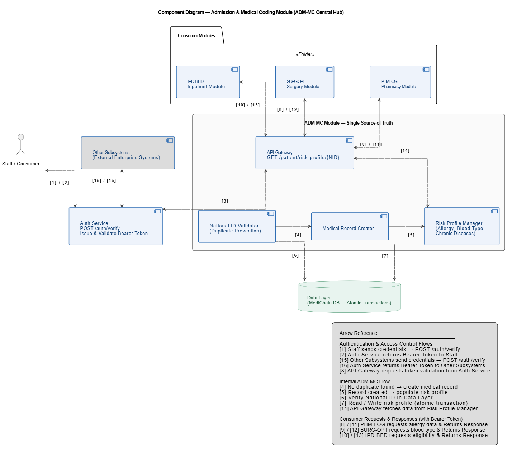

# Software Requirements Specification (SRS)
## Project: MediChain Hospital ERP System
## Module/Subsystem: Module 1 - Admission & Medical Coding (ADM-MC)
**Version:** 1.0  
**Date:** 2026-05-21

---

## 1. Introduction
### 1.1 Purpose
This document specifies the architectural and integration requirements for the ADM-MC module. Its primary audience includes the project supervisors and the lead developers of all hospital subsystems who depend on this module for patient identity and medical risk verification.

### 1.2 Scope
(To be completed by Student 2: Defining module boundaries and core benefits).

### 1.3 Definitions, Acronyms, and Abbreviations
| Term | Definition |
| --- | --- |
| National ID | The unique legal identifier used to prevent record duplication. |
| Risk Profile | A mandatory digital file containing allergies, blood group, and chronic diseases. |
| Digital Medical ID | The internal identity token generated for verified patients. |
| RESTful API | The protocol used for inter-module communication. |

### 1.4 References (Student 1 Responsibility)
IEEE 830 Standard: For software requirements specification.

MediChain API Master Contract: Defining endpoints for PHM-LOG, SURG-OPT, and IPD-BED.

National Health Data Standards: For Medical Coding compliance.

### 1.5 Overview
This SRS is organized into the introduction, overall description, specific requirements, and appendices for ADM-MC.

---

## 2. Overall Description
### 2.1 Product Perspective (Student 1 Responsibility)
ADM-MC is the Central Nucleus of the MediChain ERP. It acts as the Single Source of Truth; no medical procedure in the hospital can be performed without first verifying the patient’s identity and risk profile through this module.

*   **2.1.1 System Interfaces:** The module exposes the following sovereign interfaces to other subsystems:

    * Pharmacy (PHM-LOG) Interface: Provides real-time allergy checks. The Pharmacy system consumes this to block medication if a conflict is found.

    * Surgery (SURG-OPT) Interface: Provides blood group verification. The Surgery system consumes this to block scheduling if data is unconfirmed.

    * Inpatient (IPD-BED) Interface: Provides identity tokens required for bed allocation and ward admission.

    * Finance (FIN-INS) Interface: Feeds patient identity data for unified billing.

*   **2.1.2 User Interfaces:** (To be completed by Student 2: Describing reception and coding UI characteristics).

*   **2.1.3 Hardware Interfaces:** None.

*   **2.1.4 Software Interfaces:** (To be completed by Student 4: Specifying MySQL database dependencies and version requirements).

*   **2.1.5 Communications Interfaces:** Networking Protocol: HTTP/REST for all internal API requests.

Security Standard: Bearer Tokens are required for every transaction to ensure that only authorized personnel from other modules can access patient files.

*   **2.1.6 Memory & Operational Constraints:** To be defined based on deployment and infrastructure requirements.

### 2.2 Product Functions
*   Verify patient identity using National ID.
*   Generate and manage Digital Medical ID for verified patients.
*   Maintain and expose patient Risk Profile for dependent subsystems.
*   Provide allergy, blood group, and chronic disease verification to downstream modules.
*   Support unified billing identity feed for Finance integration.

### 2.3 User Characteristics
The primary users are reception staff, medical coders, and authorized subsystem operators. Reception staff are expected to have basic system navigation skills, while coders and subsystem users require moderate familiarity with patient data workflows and hospital integration procedures.

### 2.4 Constraints, Assumptions, and Dependencies
The module depends on validated patient identity data, approved inter-module APIs, and compliance with hospital data handling policies. It assumes that other subsystems will consume ADM-MC verification services before performing clinical operations.

---

## 3. Specific Requirements (Agile Approach)
### 3.1 External Interface Requirements
ADM-MC shall expose RESTful endpoints for identity verification, risk profile retrieval, and token-based access to dependent modules. UI layouts shall support reception entry, coding review, and verification status display.

### 3.2 System Features & User Stories
(To be completed by Student 2: Listing functional features and GitHub Issue links).

### 3.3 Performance Requirements
ADM-MC shall respond to internal verification requests within acceptable operational limits to support real-time clinical workflows.

### 3.4 Logical Database Requirements
(To be completed by Student 4: Describing Patient and Risk_Profile entities).

### 3.5 Software System Attributes
 * Security (Access Control): The system will implement Role-Based Access Control (RBAC). Only authorized users (e.g., Doctors, Nurses, or Receptionists) with valid credentials can access or modify patient "Risk Profiles

 * Identity Integrity: The system ensures that every request for patient data is verified against the "Digital Medical ID" to prevent unauthorized data leaks between hospital departments

 * Availability: As the "Master Integration System," ADM-MC must maintain 99.9% availability. Any downtime in this module effectively freezes clinical operations in the Pharmacy and Surgery departments.

---

## 4. Appendices
### Appendix A: Glossary & Models
Component Diagram : Illustrates ADM-MC as the Central Hub connected to PHM, SURG, and IPD via RESTful APIs.

[Component Diagram](https://viewer.diagrams.net/?tags=%7B%7D&lightbox=1&target=blank&highlight=0000ff&edit=_blank&layers=1&nav=1&dark=auto#R%3Cmxfile%3E%3Cdiagram%20name%3D%22Page-1%22%20id%3D%22xUH85-fEbjcfQDLqfJhq%22%3E7X1pl6LI0vCv6fPe%2B2Hew6Ld7UcRUBzBYhe%2B3INgoSxqK5bAr38ikkW0tLprlu66c2731LQmmUFEZOy51Cd2lObjg7dfy7tglXxiqCD%2FxPKfGIbpUV%2FgH2wpqpYvX75WDeFhE1RN9KVB35SrupGqW0%2BbYHW86pjtdkm22V83%2BrvtduVnV23e4bA7X3d73iXXb9174epVg%2B57yetWexNk66r1a5%2B6tE9Wm3DdvJmm6iep13SuG45rL9idO02s8IkdHXa7rPqU5qNVgsxr%2BFKNEx88bRE7rLbZnQHmcXWYLyPkCUMl3hLmhXSqhyXeNjPThPcyr27%2Fwn1iPn87ITpcgM3tt0%2FssPOlRx0z75CdUsRmyMv%2FkUf%2FGe3S%2FW4LiPyH33jhwUs%2F9Udb%2FPl%2F0Afhd%2F9jKD0rks02xCnaBvD%2FmVfsTojnaLd93oSng5dtdts7QwHiMd5sgWh4BZC12a6yYr%2BCj7tDtt7dPg9Wz94pycTdNlO8FLsNDxsveaMbEUCGotnbPkOUpdEu2R0QLYZlh%2Fj3bq8uHOZhjw4seoh%2FH8MCbiGwJcruTacnLwgqTtKfb59tQRmPqz0%2BA6G8eXjwtvHVw9sOfjOliCPIBnZBbCnO8%2BPwsDttgw4JgiCyYrfT7hCsDp0OjPCZ53qXDjcsoEYs94W5fnw1F12wxnrjx9vV8YhP%2F3%2BfPP7C3yMC5XjpHVc%2FRsNXsSeIb9BAD78Me8PHNPA9nhHeouE%2BkgfQUW8bJj%2BGpTjEv29g%2BZn8eYglTf5cHmsV%2FMN2dWgF9seZnW0ygveoIy2NCQAgAvPpK%2FVp0ENxDtLN8VirNfPZS%2FdoTBhKXgUbMLcERi3K4EVOBOq%2FwLz8Jo%2FwGYA%2BkF6T0%2FLfb1uXoZ%2FtDsfWuAh5tjpsyVh9dXjZ%2BKvjfcvi4Th81B9dzJ2eec%2FPBGWxsk%2FHUwqc6nbBNyFI3RiKRHyuVKfPzbM14a1%2BWh6LY7ZKjzgc%2Bv2rg5qwhY%2F7w4bIql51Azr5BvjcmAhaNYNjb7M9LneH3Z13DU%2FgdVpC6%2Fc8zXWjIsEjj8WX1WHzXNRPpePxtLqZFMtLNqA72MytwMMg%2BsYuXm07GA1NY%2FL2RFwmDeRrdZ%2FpV8Lf5Wo79a00dKVJ39Rj9N3p4BMHgLNkHJDAe5MD4G7V65Z1TxJ8GAPVZ6%2FhzVioGbcHj0R6ijBF8W%2F7w%2B55g%2B8XAaIi8UQjLpx5ksb2w%2FcoxLkRtkj8hde7QyMV%2FGmfgEoQ7j8dVi8wEgZ0hQHf%2BAj8RZ%2B0lQ8ajNw%2FrCr4LQBNGD0EoAGB5M01iZTsbSHKadEbJsnqEBafGJwcLtnt8BUG8cKjus9ofdhtNz6xBccV2N8rUdYk%2FfcbM3JffkhwQqIDIoB3pKdr37uzfjWyxhsZM1qD7iBk7tY6ZbuUIGyAYzyCJQCOI9J3JInnviP1jY1oRBcH%2FWsMdny%2FQlY9EyOz3h02JVhmMlMgAeE2hRn4930y9%2BAIME69ofLOm24Qhi9J9bH6V4QQAvt%2FDuvWsO3IiuTPd5TkaSL%2FNpuPG8Oy9g6p5xcXLb3MMvR8CEU3tfFv8yejBqOfDiBfd6Fgz4dgpCf%2BN07gGzu2bZX0NRzo%2BgMi98v%2Fq%2FHSVgkxEsc1pjnXpnlYJTUfmIIGN33lnw6brHhFEE458ZUXAf3tt44wEs%2BCtA2reaariaxcMHxn8DsAufjEHwHSv4GCATMBU5nrHwTD1oMaIqVt68JrJzffr6r8hRCqEBvfhYi2twOwVwOsmq86op3s9OzXPWuQ3a6VPWs6NoTVAN7o%2BeVHWHCLB92rOdlhQ8cUaatvp9Uxu5XbxrFihyNo8ZFYqy2aiUesb5BqXvz1dgbpGn1iJX4UyuAWSiNOaCN%2BFAhN3UK5FYxfr4r3bctsFa5IXAzqSbLsD4xv0uB6IBWW1g8QG0gk6Xl1WG1JoFs%2FQqcOHv3r%2Fz58yA%2BXKYRAHQNbvy31dH2c71cJJ5iV7LBD4yomtderp7njFagmRzuCsOAo%2F7AKELaXHJsw7%2FOnAZa9HmdCF7hMC%2FcmmcJMPTsdtgj0JivComSLyBWStde5kwNW%2BP5pdCs39geQvZuWXuCyFzZcJUYIuDXwWQ3wpcphqpl8PuzS1wj9T0P%2FOz6089SJbNpcHLXwSkp6rZQoKFNBJ3V9xsLSjUD7mIniw7TNUg9VltoF2kZqlxS2GngLbr%2Fbn5IK4KHKWpvEvAvucwvOqtQHkL3Jwauk8DppvAD40sHHC1qvb0Nwe%2BfVkOx5TTaZXbLJf19rbc24W916XmX%2BmmSMVQm%2BUaY3kvL%2FqdV%2Fw4d2nr4fKV%2FiYxCl84ZY0WsTfi1L98NikoGTXP3KYntN9aYRsOs3Ny6jweHqRfcj5ypJJ%2Bn81ZuWdWmoXqB5x3seBNckiycJ%2F9V7Vskm3Cw3SZVpfv814HTruLKO1j%2F1KPhG1rMupZNOHeV5d0i97MFy2PEl7Dz5Uq2wtYt0K2eaOca30dcgz91oEXx7dje%2F0YN29a9d1esu49Ure0ey7ENajmtvjx83KVmt5La7Wb2gR8M3CAowjkqGWEWCtmyH9HvHfbUe%2BrzJwXCyHBk8bFqppgU%2BE0lgh9VXRiQkcTnyY%2FQ0URi34HpLOz%2F5JbXxJhrl87uXGRuwQdFn5aL%2F4qf%2BixwNz%2FJoUAapv5Em62w57pfz7fro2f3Dkz7dBRPtPN98fYFR7Gzrl7N0ULjF13xuxP0ZW%2FWTNly0ZPqUa%2Fcpk9X6y7FlrhZcAuMpd7GmZoxS%2BoUUumORcnQ69mxx66diNltofX9sDqRYE01K0XWLM3VzMAd4O9dOtt5EHUiRUCjR9LwaSaE%2FmSY%2BYxVBanE%2ByyUOq%2BnOQtsvgb5lOji5OvQh7weY22DvTrTdPBIo2dDOK%2BBuDfOzbEiMvOV6c2a6dpgMcBnQy1T9LFHuWIvhJzoCL9zE3yr7JdNDHE4ywA7SJAmo6cuKpzbyaHiWeISthgTeBp4zSRyMQ%2BxfvRNwXqWDl6UpnlyRWy8jwBNoX6ZJutLBf3BPE20fjPPkKVZelgvuZZlap2DECQ2HpJETzXkpl6NjqNpa5i2U0rMHJ2nkrpeL4RdJoBN3nESOfQ5VZgCc7W%2Bh7cWdWEdXH%2B5UU1NmJs1LgpIst1qB%2FfSJtfndOL8E44QCTiEWYy1xt%2FLLU5Rv8UcaK0cH3oTz5y20I%2FK1nrtyyVqFw5ggJ8nJNYAPpbOBMWSepbG7X47PA2kjn2V%2BiD8baHtZbtXMBWo8O%2B8DTM5Pk%2FUSeOPCnAUjuvQWe5AVKVcubWw7%2F%2Bn0ZTlWAU6eLNOA8gQx9rZWGcAcgAzA%2FAEeIFvB2OoFQt0HnimG0AM56gFcSuEFmM8Y5kXuzyKpVHh182s4Djjyva8zxkeuj4RsZivHYKEA96SQjNQpMh9%2B6DD52mdloL%2FtATzQ1sFYyFDPYF4ILzWBatt9ZkD7qZLM7Hy%2FTEEHIpUCHsSgI%2BvZwtq7wBcci3OjwJx6ttqBP31GDKSo99VPrQh4ksJ8HYF%2FkRaLY9V0uWu9lHso8%2F4W5d0B%2Fk4BH4mBPmUwSY4oG6CLxZLJkvlGZpTIwZ8vTdts0ernSTFQ36rvAKOnlDhfCNcsFZjbFZEzgZ1FcQ%2Fnblb2vhJednCUDSHHH3h%2FirZoZsN82ckRx6qL6R7moZVFn0k%2BE9k15LYtYIA%2FzJoCnm6WTB4DnCPwahuM15w73tM%2BCzRvlbNjg00gtlJLVhNNrvogriBniCvweM6rfRiP%2FABZC09y5Jcg2zCzF%2BloJSaVyrAAC%2FJFEhFyAG2cUWtZuGSc0JpMaXjD1xmLb1SJ5AxAT8%2FrmU5HywnowtgqQN6ADoVe2vi5hr6Qs5nR%2Bwp%2BIFqOxRL9AMgV0KIlQEGj0yin%2BwD1I74L4w35MukH8pXL9%2BSLGZx81spQ2g17EAd2noBfIHaQgzeEIUIwDJWdj3r0jAdvU814aPBOrujXbaohn5TSPMpFj1V0tMbDUNaHjGyER6V0TsB5ShlxshJJMA68iN7rzY2QkoQzaLdAzyIYa8CzKOzPCTzppOjnAtrD2rqjZc%2FnI%2BwPs1jCewFe3VbMeb95BydvEDcc3%2BJxeQfAv9DR0Cb15noP3wv4CAXpBzDI2NEwl6Cfsrl6h6zwPjPDn0it6X%2BNL%2FTpISyllE9Ia2VRk%2BMS%2BNp6t03XSyoUeL%2BDa%2Byi2mKf52zdptOsZ2tgTXc5wPwibb4S20Tm%2Fg9C4Hoy6B1SQj6DP8TZQV2RiT62s4H2ukCfIEfmac4j56WXv8rPyMVf52dkY0g1fmZuOLWfEc7KqFfALFBS1OfBHpWBTYPOccqS0WiIj0rQYULL30BTa3%2FBR6zBT0fvt2VmUdMEc2Q2NNHKppeDRNLgI8BqCaxsZGO0laDP%2BB3s9vG%2BlWosTKha3FSj%2FVdWqfForTWxwStDfEKsdzXmLS%2F3yAqdlU1jhWp41oAzhWRi1VZnCjGk2tEQS9QiBaUg9MaNPyCaCnwI0bcUJPZDTcXPRvv5ns8rNMMV1Ej9EZ%2BHsnJCn4zwwf%2BBlWv4Dn62sRSVBv4Y1rk8eqDnscloAkjrYy2tv6N0m7UnjpmLJw6Zrid%2BFS2Y1lim3NF1tADRy0ShVmDxQYqBW9MXjzE%2FS%2BVUVGJtpPBZ05bVUfRnoJqeF92oWr3gore49D4OLnHxZoQiyKUa%2BcX7I5R3Rr6l0JEklbpIklrKF6sEehCHGiOC9QnWq050%2Bqvwhkw0r3BFvvrgu4hm9asIXj2BXwc%2Fj3qrUZYpjQZnzP1Q02fsdO8zxwzywxfUClcffDHiRHh%2BEHPXtkDn5rqpvssWIdSLrVFegsU0Av3BLDgheF6iKrq1O8Sao%2F1KYpC32hYmzwTWvWj7rsxiDBFCPICR8RQtc1HxikTd9ec%2FK9OQgTVyY5gdC2T2wPL%2FcgvkU%2FOLRNBzQ2giHIwLCtdWOj5UETXTKbUYc6Z14tnBLiB2%2B8%2FjgxFVrVlMh0N9iELfz6HiL%2FAcTfTBKrxzamyRYsRvZ0s%2FS6cNmbnoNMjRZQYZuTQ7mZGRihTm2SRfNtXQSkXQKvT4g%2BKtWEmF8UopvTtWghjs5LLaDnL8b5ifoNb4YzEi%2BfyGI%2B8x6j6kNsHLd6lQ%2BLhjmX4XIFKBCNlBu6pzKug2Q%2BwJUPaoAtBaI10zX%2Bdrb1kjM7b4N61R8cgaha%2BsEYH1w9bIhzg9zpWfZI3mvNP707r2F1sjiPAjuatvvzgOQXyECz7R8PzB8KE%2Bhj1SyyazmRtxBz8VpFZiAYvNU3yp8JnAtyU7jSVBAQ8jUktW%2Bk6GY8aJoRdUdlNHbZ7fq%2BHpuqXM3tLj%2BeiRHsd39Bjf%2F47sJpd5rKOoxaWaJxG%2B%2BNv48vnP6k007F38gJDXGT5qMzv%2FANmNUIIP6WhzSP1i7QF8hl18fnHGdYtPfP4Y2iyfa20m1bY2soi6NVczTUqvQF88QAwTSaDXy1TcuosrXSY1kI7clRwPeRKLWlHHD6lj0%2FslqZOKhWeLx5a%2BhbJfkUqEUL6%2F1gK8rWoIr%2BhQeOkqthCPELUULhsfJWF6XDKDWBLJCtrxI0RIsjFs806skV5sqwnSK5xlw8FVlx3Mw8mz5VAbJyXY1NJdyPsL%2FucXFyRK0qnWQkoiJxn6uyyqqr%2B5KmIyD6vWr%2BtFBNaPZhhziAbnvNST9b%2FRlhpOv2NLzzLObVWh632IyAis%2B8Xzg%2Fz%2B6sgoV8q4g0%2F8qyOjW3w%2BRGSk8GZHe4eM3FT7IvkSGSWoibRsUP6HsJyY417F47UeYB2mqVT3VW8sFktbjCDDqqvv5vdiONrStffFcIZlTSdvxHD0w1yMzNVNDEfe%2F8Eq1HnFX1KJYTqVGOCz%2FP5KjDH8CzRKaLxmXzY%2BksWJzzAfF%2F6AX%2FyVlSp4f%2F%2BSPQt9ZXTtI36V9rZrTGw3E7u2N4plxn5m0Jz5ASKcvtxW1eMOR6%2BsjQF6D5HltN%2Bun3%2Bv6jM1hffVoHWLe6sGTT%2FMFg31laUhsD5UDVpgsYZOuMzHxQeyMRCNh22cNR%2F94movYNOuNfflD4XNR7EvKt2pPBd345k4UbURPdJM9UPEM7hroFl%2Fkcpa9gus61%2ByQN3ut%2BteP2xjDEsQx9rmnRENGfPWzr%2FLuMBu7IqKOxdQttq8CuEtaMVUTXeMtsYFG%2BMtuNLVuaiiFavRCtktNcc9NPztvhUn1yJxfMmpwsbm9B7IMGYgPeDZHRkeEhkmcQHQ5Y04xFsBHI5Az7nZW2PwZm%2FGq7lS9Khqjw5FKfq5BBt02Y9TCjim144xbseccQwllw1NHHmPwuNOtuY9fg5jSojRqjGbxgZPTyBPyZ%2Bh71UmUe%2FO%2BfurMu2OGKZdv4Xct1ORYbW1mzrhrOAue2Oi78jwkyWsRfN9MlyPeSzDCtllc1eGy1cyTA1MXbD0u%2F5SUASV0vhfsGbLyKO2elTI0WUNUC7D%2FM04%2BC7OwvkvyRWaSIl32GYn5Bzs2Bs%2BnOCiCfLft2LLO%2FQFl%2FDj4GJIXVx%2BXf2Ob%2FIXzFYvey%2Fkcthdp4XeuH%2FTZC2QjgT3nmZ%2B%2BQF2j5Csz7xLwfXukd8FGDm2imUKfltA%2B2IV%2FgR3kJhAVU1REX93J5tl6qN3WSPOsjTprXUeWX%2B0zvM6cq%2Fe%2F%2FHWeZxzpybTr2sPZMcGVr1%2BcQwPstzUiMgq%2Fq%2BNmgEbYfOndtj8Xdi8yih%2BVUTs9y6erbPaHkm9Swwv4u740CTngpLI%2FQg72QyhowWA%2B8UW3azpmMLAsEbDF2dhQSw6YFzAwt3GHyMb6c2vIosu%2F7srOknps1bSno8RXdxzjDYukQSQ4sUU9z2bKIXL78V4gvq%2B%2BE5Q34rtDOlBbEdinJvYThuRuK6TE8x5GWJz%2F7LbRJB7oCNHpQzbMwhzw6egz2XdhY9ZZXRmL%2FUKjn%2FdB0%2Bq%2BFdw8OSKUsA4ox0n1209jJ3n5PwCzHzTVjZtwz7Y9OOc9yGeDHG3fI1TCBLS6%2BGOesD7dR9CW6cPH5ayfvUu%2BRX9m07saKzHimCNH%2BUnqhFwiiD8cP71iNdziMOveR2eb3jdk1%2Fxutun4nUXzmteX3LN16cIO37QFFjV0Lg7fvDcOR%2FxWl8xzi40%2Fe%2FWV6fR1Z5i%2BLUlD3FtudnxK2DcIQn5emVbb%2B6pI7FvbP7dEWeB9ruykSHd7C6f8yZwE88SmJunzVpxbW2vMuu1Z%2FdCiELC6QYkIxKKecFxwXiQ4UqyNZmul1tl7bDaHvPJRzvtcP33GJq0xmmxA1b766MorjnVel171an8Tl2ksU8Znmapo7LHNglPyl3bpCPglF9O4yGO2XOFo3sV5XVPSAlYMYBI7kwBn1rpB0kHDVfLGZ4eanbV8BJZjfhumyAXMo91%2BC7MYdNGV3sqrtvImYVoeFeDCDVJVfWZmaJlCeGDSE7hZEooVeNOJNdaisFxZQcvy44FqsYoeCbxvAQ%2FHEzk6qzwK76c82qnqXRUwMLUVuAIfh2iV8jCOzyY8UIJn%2BvxwmU8ZNX1eLrJqP9%2BWpo5IjukGJngh3pWtUGE1rS1%2FZROm6I%2F7tfAe2C9CS6A073o8aGVEzmwj7n6Pit3icQWQRvzO%2Bng6I7ebU3oJreGme3uFs2BKxTMZA4WcClbFFadlnJC3c%2FvKs0X6krPRHuRBCK7r1ZoUKO94o4VwFMCtCZp1uvzujNDQm5UuvBwdwqpmFztTlmO%2BweMteockODYVKMWVAUPLBjWhXfSGPQupkqFHx6r04BYQVZDFXyAPAI9xh0qhop6XPUxVKx6lsQzlvAZZaYA%2BTDuViMJPjV9WWPt7nrLWqbvZY2QnWEGCLKe911mcOr4nkb2YPa4F6CTQl5XeKkssXkRyrIMfu1M4T4TGdffRueGXram9yjjyRdexbNTzRikn8LIqRrzs%2FCu9c2ocABcabKXLhIueGPUEjl5hbfMtHprtHiT7Lka84fxvvXzEKURrX2fn7%2FkHX%2F%2BjD45N97Ua5q9hbhTVGKwavqUgGdsNNZwg3u7xCo95OpTfRy1hM9YZ7l3kp74%2FztaKaBWqroZLO74%2FOIHKjfM6zXX%2FOSVAttoDMGSrs8ewr8E3k2%2BATE6rgXg%2BeASNRQ8MqvwkG8YEkiHz6CGVn3MTi7hUxC3091843Uf%2BIwr1KNuP%2FDauOpuqAC%2FzUM2rXSk%2FRewRo3FqblLN3z4w16De1lOku2S6XU8R%2B0zMeoeD%2FZgR8vqNIuA%2BgzxDGQvoBcQa7C1PhPuzCrKQZ99PJmNugRjTBiDVe9mTMVRoL7i6M%2FAHPgq3%2FIVsHKw3k%2FhvChFE22oNGbYytW8nMlaSTX%2BEq0AZWUzvpOP%2FXO8dz5vKuMQ%2B8%2BiYbNyRCsYe5VkRyVgbpfKW1YAz%2FORuB5Ps7zXAvSn2uh%2BVP%2Bdczbs67ot0f7ejfYDdtrlnM2V5pPzLRCLOqWsdzJgHvxEGR6VSM7bLJiXMT9irvryIYMriHJxZuQ2bn0QkxM6abCTNJ43%2BglxbIi7xW5wO%2FeI9eFloE1qTqpBlu6UVf5yoQ2yeRr8Zz3evIyPwnp8y5s%2FTMurOiHqAvjG99UJLys0f%2F4ukfbuGsh1yepxHc06uNpXkp1%2BEM0q4ptRrDgV1cojkhMm79SHBEc%2F0gdyxuRxllu%2BqryRLHd%2Bm%2BWCLizo6dSkjrfxay7zaD3Bll%2FrBN7xwlR5W1f%2BhZzsX8XqXEdXoC8L1hYs7g%2FoBaG30ov6PM7f7yuAGkIley3xuENYPc15%2F0o7kBrQpBtqzljfohoYnUy22jNFYPyjNQToh8ggCqm2wh4NrzyG9UMeQxOk9%2BV43ZPg19Hi21XpUr6nGwXuwe%2FqBsK%2FV5WufIWDesFeVUsNlP3L7Th4B9EMz2l2%2B%2FEhBbaUVfQzc7khhuO%2F05fFHSyQf2LU2MPzrnjrDsRdwHW%2F%2F0bUSE7XA28z4O3P8DMtvnOy0hnXfkZu8KVqfI8Xen3UKLaKJ4EX9XjUvnZ8Sy9qak3vP0%2BLQH6Q5qZq4ufKpscoddVEebtaIhIL%2Foe06MaTXHkZIjUPqyT%2Bq5vNSJUkEq6rJMS7ZM8I65WHqeJztJu9dr2TeBisiDj0VTuuI%2FC4DwIkIQrPHQ9zJndqgEbN%2BWGnEnuvfYhnpGCsRO6xwroUqbJ0YROtCos3tKry5QvtZWZqo5%2FlpVqsMfvoVfUUxFptsKZqrI8dykGPQjwNVXkpPmZqGFin7MBoKCeesPiH6hfQCRJV33VFcgYDeRO2Xir40erGH4nl3q5ufO%2F8Ma5V38lvpOJBdaOCd7uaauDtOCauOVBX8RyP%2B3awtq5247Y%2BxPt4b2NHc%2BLy1djbNox6DMgJDNxhaTIdWGStYs4Lb%2BRFFY9mVhWP%2Fv3%2BKsY9HzRZb2npPPfnBsSxBtYxVLrNi4w4v%2BXdjI%2F7WOOvdpj6l%2FF4C0g1%2Fk9Hfe9Yd6n5jhWLMK%2FtQF8pqlpnxfdzPV9mpf9GE6XGOO7cHVfNV9zO1z%2Bl3il3zgBC1H5Sori5malQOnmdbGhvWQM8kVqvXt6%2FTe1NjyuslUdVzvpmtDdi1%2FB%2B7Frc5HXwjgVV25wbOwC%2BBPfmYZxVzIntl2qP2baXMsZfZO5B70FeqlhNzTt6flaQfxiXgQy1N0KW99sBNmZXAB90pb03aNjHnZek0nbp%2B8jrIs%2Bz9ia6v1%2BfWjrkCH1rvaYBPJJb3snN2keHRxKuNdTrHfUNHAQG%2BtYLjIb%2FGOf%2BrLWQObnDACuYl3lsbdgI58Xs2EDhdl7QBtL1%2BPOlglrb0FF3Xv859gIy2csp7yrWauwF8uCMtW60F3OxWSMR37Ib1RnVak2z8nXvrAiR03iPVjWvI4w7UcT8fhRB3UQRBMtH1oPsDsHz9U3sDJmvYgyPcol3qDrnKvPFPjJFVjEjksnSMq60lVgh8t%2FarUBOG%2F48LSd4ES2srB1mm06trWpeZaqEXpZUQKssFaWdaH87BuknVoKM%2BVl4l%2BSUP%2BEn4oArl7haA9F9i7fMgnay5A5CzK435%2BqWlXYMzhuu1pAx%2F6Co32luJWGVdr8xRKsos2Wtse2q5vQtjcWzoX%2FY01%2BdE32np5%2B%2FPhdDPP3tPiV8xyNdVYhMDnHnSTG%2F5NcsOasNEb9MdvFWHrpaqev0q1b3Ctx1dL2u%2BapPiZEUnjkCj05WDUEO0VPQb3hzcub25%2Bm5gysgZ9TbCz1YgQO80SOTE4n1Oh%2Bp4F3zDKtyxNqT8eplPO7IIuNbPv4EWiqeE903zHbVtdJ9wvN61ZXoPq1UK7UlRF6V7rdjhFr363n65%2Bg%2B056JNZpVGwkyoV7e6L5scIE0%2BhrapVAuXu9UvPbGictYJ%2FeNHYVgae%2FdTiNo5K96fZoCZyZyelWdj5xIYzsn0tjHJ9KG9Z3U92eie5pAITcpkFsQCnKS2yA3EJzrncd%2F4cnEP3RXd3tjhMI3e2RjXDWByMHp4624%2Fnb6EhSc7tpu4qfWCXj95m78mjOjd62cU%2B%2BXK5mc26nuc1CbM3V98KFgA2TcfQvYTTe478Ev5oUTYS85OqYS1rFL6cv%2Fnn2wZ2%2BdmftZ%2BhCZ%2FTv6wKA%2BQD7GoD4EC21X3WCqQDSQgIcYooSfcf%2B1wygJ2Cn8PSgntAvLETdejgfsm%2BcBfxZtpczcoQ0yh6reKoIN5oxgLKbuhiuBwtiHuAo0Pq6oFY9%2BQX43Bw0z%2BEUSuSeTVsMZQ04bvQSpBbrt9v%2FqW%2FyV9%2B%2BcKWVSRSIWl2p30XdulXpKjsVCH4YqOWPEGe5iysBsJmD1kwCiwOUWZjC11kB7IYkaWHfrRLJEUaEc200%2FAI2UzDuvaMRVCbw7EuKgXuVXrUASBpSHvw1FVGhnq%2FTxN50sF3LoEy%2F6Xzm%2Fj2jHiiHYf7mOKVyg%2FeYknM4V7gIi3LRfvjqJtSFrCU%2Fgf7DNCOxpucLf0mLTf%2FlvpvhDNLeVjyuaS5xvjO8JzTQVkkqGzk3wtFnAiH2UaX9hgVXSSpThSpbbE2l7stoFHn6pc8SygZwk%2Ftbdf2gvj%2FU91OZCNuLN0%2BYD%2BbD%2FPfvesw8hVQIlj%2B5JFd4jGZN7857i5HQ5Ey8Khk4ralF58w9gD%2B76OLAHeIa7B9kFU%2B%2BGA3vQf5HGV3ewp5Axge3v2PpxdZczPMvwdBn0O6LdcJhB4fIfIXIZ5q8jF%2BGMt6TVt4wtcVe8JNY4V34NojMrrn57nQnjjriCfw7sHNrN0K%2FuwD03d%2BB%2BgDktFOPenAp4Xgd3h1L1zhOgEzMx%2FI2J3Lyy4X3AgZtqI24PfuyHTzX%2BLFmtTl%2B%2BoqvAOxoVXiaxikLX82erWAdcwPtRHgtvoRykCVcsGcTbDH%2BHrH%2FJ0Hun4Cg%2FFU8%2BI0ZVFP72GfGf5q967R39XcuCVZ%2F65htyhgM0E6ttkhCglLLOIga8LMphIPooqgolzApQTYV%2F9LbmX%2ByhDbPfVDj%2B56H%2Fq559DKmi5OKeVNV7FsH7PXV%2FN6PYiXLbexegjeWwD%2BjUcBcwCWZ7I%2FB0Bd7XY40HB9fu7T%2BAhaTInRqvLSTeYsuCzShv1zSrG8DJvcPgyaw8sMGLTuTQAc8M2ewWPENlQzq8aDJbM7UAlwFYzo8R4atn5Z79IL8fw2cUvFEjOfYhX4f8%2B5jL4P%2Bq24DpJ1NUr6lP85clo4bBJDnj7xGtqzJ6m%2FN1JOLjzrqUV7t2q6qMcG4pBw%2BJq0szcyqCpwcZFmkX3gL%2BIoFsbuvZU6AAV7R%2BlPLL6ppJT%2FknKzsbomua6T6d89ZoNdY4g3WnpsV9m4O8aWYiaLZy8Bh3ppZioi6Uqc5Po5WQzWWmr8iC%2B6RSfd4rlbGdqIwT51uA15MFcT8zB%2BoKIukAPLZBTQWdDY6mHZj2Yj2ZWe5zsOU8V7CeFkxYasl6iosWpimKeuRKvqEdwMsnhrX2bCE5W7xFuxa3mY%2Fdo2KFMPOBYVsc7dq7whKmhsf7fc3MUqe0dnIJUVGqCIrFxW6cRLKdlUEkTl1bYoxtmBl8wFpUPvbGa34uKJu5OT1qC47Tk8QJaDW3kqlpCnTPj%2FdHy%2B5Pve1UMSg1W6XZ2jaz3I%2FXkW4OZitxSDlJsvfZvWnwa0eOko0%2F4WLFtuK53VdcanCY6%2FTv5kKZGOw6VhnXkstprtIyo9PcUVnsKZWRiiByZyuzP12Nc10TQaoFca3b64XLBJqVaO6KFz%2FLjJI42yTVYkuxQOK9WJx60bSnxxSzpAfTmWExS3utuZMpu4odxoU5l%2Fnp7xpESXa8f7bH%2BWd3nNvaONNXifasLtYLleUSldaecaxlajtrksgLlksVer13ysRxJxolU%2BdiZg96QUHv5NidG0J%2FZCXmWRvnI5dKYtmelgtmLZiRVrisNTKAj0ZMP3n2OtImgbgca6NlHKyX7FTyxOSzLrrsHPhjWkq2pJKRy2Rzz87WFqUxNq%2FSWI2ArGVm0WIib%2FesS31l7TjT7G2yx98vPhf3GyOZ0itxwDjpEQQmcNVkzeqGK3pU8ixPOM43QtYxKcbnXSkQpcziZdqxg71MDVKXBpHilZ0mTp9cy2S9NKQ9K4hUO1ADxp34icva6f7kURJrRpZtm%2BvtMt6btrU%2FB6LAqKZGzSfB0aMTIWAlxrLdXDGt1BQ02TKPfTuyRLfkeio9fdHG%2FViPlYnM7LLAmG6t8dpa8dpEs4%2FFXBzERixRHkT6zsL95otrSY5c3tuuR%2B6WYwJTmweWmC7H9MFiBolmD%2Fr6VmVNmFfV7kOgtU%2FNrVnYk2msiIGi2omus1xp2wmtTayNzILE0GsF5iRbGkGhiIq8EtffZDaYa1SiG6yZyaL2tGTFXpBmjGOvefClfZN29aU1dUB%2Bn01aEWQL5Vw7BQvuSYsDZ1lqbMAM1hq9puRyvV9QwTygAtoQ3Ey2rVRmvuYGlRQeY639SFsbbJyDnCRge1x%2Fayk6H1A665rW2PpdFgaCwluSl2i8ZyhRAF5iPk5on%2FEzyxZHXrzn3VI7ecma0Tc0o4gcq6TiVInVsw5aAnbHdHku1w2F9W2q78d9S6WCic9oc9UCeabE3pLmctdUvsnAU8%2BW%2B75hlcBvx2chHxx%2FLQw78Va89U3jnUIpxbFhrrlA6D95Y226NARGpod9nZVZKw5O9oJzNEs4g%2ByOXFrtaZFTmmPRW6VrYRmH%2FbkRpIa4ZmQL9DDSDIXJXgzKYrVUOyuM9mTH%2BcsqsZ7m5t4ED3I0F5ZpTKb9mZl%2FU4BvuCZsjMW%2BabszS1zPZNDdwNKO%2BnhdOOzaltlE9cuwcE0aPFIw8VJ4rlOgE1PBEveGMlYpvUxAlq2%2BVyZzsAvJygg427Qszdyf3Xituun6PB8rPdBl0HOJUsYa7fKuozNr0aVovMNqpIMtd9gkBz37ZqeWCV5ddxg5N8bn0qc1QUv7mb%2FVNloU6Npkyhu2SM9MzQoS7qSlaw3mg3MTk3XYXWmm2rM9We9kO8w1G3hnKjsrUhg3cugFRU%2FmY1qT0%2Bl4vpjSCh%2BD34DMl16flvyUctLkYE5gHsWAdSdO6ac5r5Suq26THfgbzadFEezuIqD2kkqbxcwKnkwTHHa6H%2FlG8OwwYumC1fVE8bO2AB8SO7m2nU7ArlCWKeb6lnvWjeTZN6YjI%2FkKetB%2FBlts%2BMzXvpUmkrJ1XR8so7q1MvBnulxKfZArw6TOtM%2BrbLChD8aW%2B31RJvFykfByuj9AxPDZ3e4T0LmJySqUZiRneyxu1AIiqcg6KIw4UcRdZkbAAdt9cWJ6rEYup8ba2F%2FsrVUyYGV6EC8jsBfCfrcsg8%2BW0MsDc28phrYDu66odNgzt%2FsoiDg12Gq9YLs%2Bz4wg10xlYiXgNXhlDnZhNrOTz4qdecuFm%2BuL3Rnk6tlIgl5gKd%2F8hXieW5wRCO55lUwVX1RcI15%2FthdKbsILPVqc4KkUd6w8q6y2tyZgX0WuXJoOE9DaxrIsVqcsyhKofLmdqgrL9ZcTMzMmXKSLluonUmmkCg%2FypmtmX5LH2s6LrbUa532fSY6%2BTqsWRetOPFWDRNkosbYIBKqnT6aTQNj1FpSbL1nlGXwvIyNFpphqYyVWhP0o4MH%2B81bsW67pbDVHKWjwQdnJTHYg99Z0LrpHnRUKj59uHKqXOdRgpzPaesHsM3s8fbaYc2lMYsZcJFtbdCGW2WugX%2FIcJMljA9kc0exq3B8F4DPtEc1Yi6nlJi63sqYp2C7I3DWMj3YYI5i8z6wEd2eMaG5BU2RnUnPX0qAMUvz0ieU%2BMcwnhnpZHbJV%2Fonl4SuNTazwiR2l%2BXi1S1fZoYAu69UmXGd1F%2BYzUw08b4JsXTf26F7VWAP6jf46qBq8Y9UStuCgVaxeAh%2FSfLRKkvareVwd5sto5Wdt02G3yzrdxwdvv5Z3wQoH%2FR8%3D%3C%2Fdiagram%3E%3C%2Fmxfile%3E)

(Additional diagrams such as Use Case (Student 2), Activity (Student 3), and ERD (Student 4) to be attached by respective members).

### Appendix B: GitHub Traceability Checklist

- [ ] **ARCH-01**: Component Diagram (Central Hub Architecture & API Endpoints) — *Assigned to: Ali Ali (Leader)* — [#1][issue-1]
- [ ] **UC-01**: Use Case Diagrams (Patient Registration & National ID Verification) — *Assigned to: Majd Omran* — [#2][issue-2]
- [ ] **ACT-01**: Activity Diagrams (Validation Logic & Mandatory Risk Profile Flow) — *Assigned to: Mohammed Dandesh* — [#3][issue-3]
- [ ] **DB-01**: Entity Relationship Diagram (ERD & Database Constraints) — *Assigned to: Hussien Mousa* — [#4][issue-4]

<!-- GitHub Issues Reference Links -->
[issue-1]: https://github.com/SE226G4/hospital-erp-g4-t1-adm-mc/issues/1
[issue-2]: https://github.com/SE226G4/hospital-erp-g4-t1-adm-mc/issues/2
[issue-3]: https://github.com/SE226G4/hospital-erp-g4-t1-adm-mc/issues/3
[issue-4]: https://github.com/SE226G4/hospital-erp-g4-t1-adm-mc/issues/4
