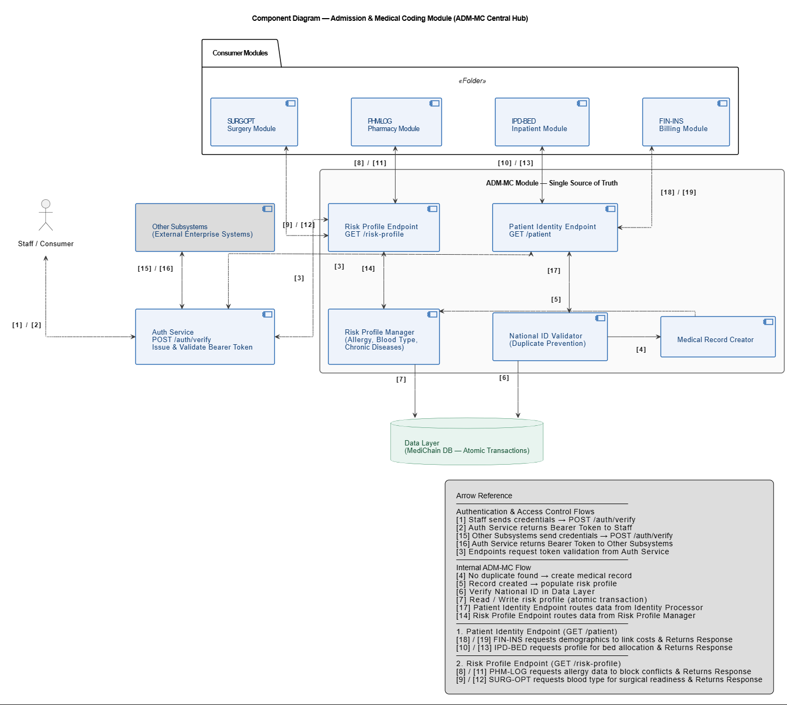
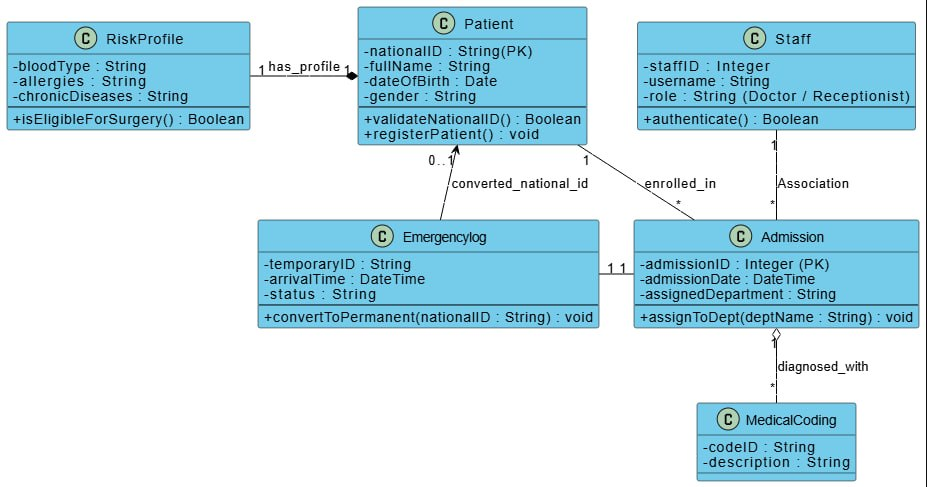
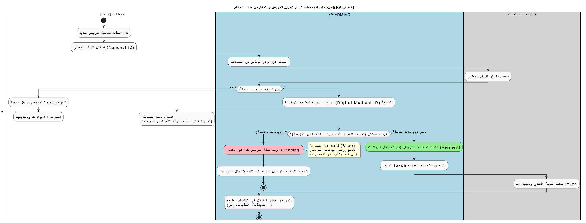
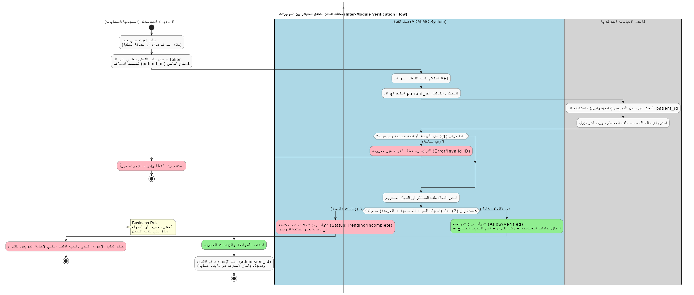
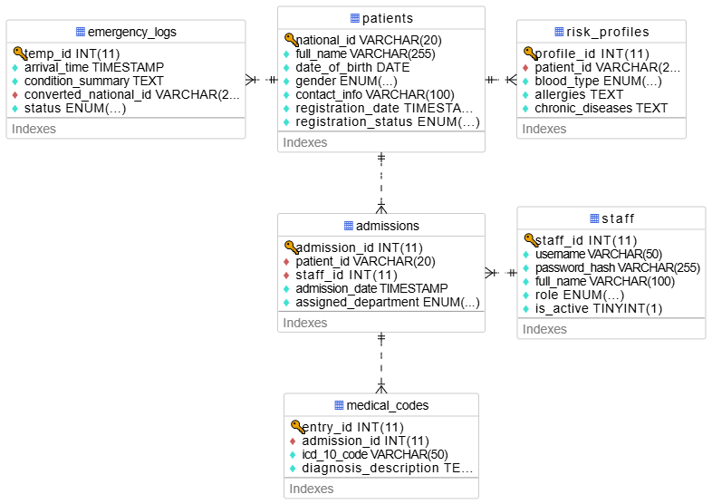

# Software Requirements Specification (SRS)
## Project: MediChain Hospital ERP System
## Module/Subsystem: Module 1 - Admission & Medical Coding (ADM-MC)
Version: 1.0  
Date: 2026-05-21

---

## 1. Introduction
### 1.1 Purpose
This document specifies the architectural and integration requirements for the ADM-MC module. Its primary audience includes the project supervisors and the lead developers of all hospital subsystems who depend on this module for patient identity and medical risk verification.

### 1.2 Scope
The ADM-MC module serves as the central nucleus of the MediChain ERP system.

Included: Management of unified digital identities using National IDs, creation of Risk Profiles (allergies, blood groups, chronic diseases), and generation of internal Digital Medical ID tokens.

Excluded: This module does not handle financial billing (covered by Module 2) or bed allocation logistics (covered by Module 3), though it provides the foundational data for those operations.

### 1.3 Definitions, Acronyms, and Abbreviations
| Term | Definition |
| --- | --- |
| National ID | The unique legal identifier used to prevent record duplication. |
| Risk Profile | A mandatory digital file containing allergies, blood group, and chronic diseases. |
| Digital Medical ID | The internal identity token generated for verified patients. |
| RESTful API | The protocol used for inter-module communication. |

### 1.4 References (Student 1 Responsibility)
IEEE 830 Standard: For software requirements specification.

MediChain API Master Contract: Defining endpoints for PHM-LOG, SURG-OPT, and IPD-BED.

National Health Data Standards: For Medical Coding compliance.

### 1.5 Overview
This SRS is organized into the introduction, overall description, specific requirements, and appendices for ADM-MC.

---

## 2. Overall Description
### 2.1 Product Perspective (Student 1 Responsibility)
ADM-MC is the Central Nucleus of the MediChain ERP. It acts as the Single Source of Truth; no medical procedure in the hospital can be performed without first verifying the patient’s identity and risk profile through this module.

*   2.1.1 System Interfaces: The module exposes the following sovereign interfaces to other subsystems:

    * Pharmacy (PHM-LOG) Interface: Provides real-time allergy checks. The Pharmacy system consumes this to block medication if a conflict is found.

    * Surgery (SURG-OPT) Interface: Provides blood group verification. The Surgery system consumes this to block scheduling if data is unconfirmed.

    * Inpatient (IPD-BED) Interface: Provides identity tokens required for bed allocation and ward admission.

    * Finance (FIN-INS) Interface: Feeds patient identity data for unified billing.

*   2.1.2 User Interfaces: The user interfaces are designed for high-accuracy data entry and rapid verification.

    * Reception Portal: Optimized for quick National ID searches and initial registration.

    * Medical Coding Dashboard: A specialized interface for coders to document and verify clinical risk factors.

    * Verification Status View: A read-only interface for other departments to check a patient's eligibility for procedures.

*   2.1.3 Hardware Interfaces: None.

*   2.1.4 Software Interfaces: (To be completed by Student 4: Specifying MySQL database dependencies and version requirements).

*   2.1.5 Communications Interfaces: Networking Protocol: HTTP/REST for all internal API requests.

Security Standard: Bearer Tokens are required for every transaction to ensure that only authorized personnel from other modules can access patient files.

*   2.1.6 Memory & Operational Constraints: To be defined based on deployment and infrastructure requirements.

### 2.2 Product Functions
*   Verify patient identity using National ID.
*   Generate and manage Digital Medical ID for verified patients.
*   Maintain and expose patient Risk Profile for dependent subsystems.
*   Provide allergy, blood group, and chronic disease verification to downstream modules.
*   Support unified billing identity feed for Finance integration.
### 2.3 User Characteristics
Receptionist: Primary user responsible for identity verification; requires basic system navigation skills.

Medical Coder: Specialist user who reviews and updates the Risk Profile; requires moderate familiarity with clinical data workflows.

Dependent Subsystems: Technical users (e.g., Pharmacy and Surgery systems) that interact with the module via APIs to verify patient safety data.

### 2.4 Constraints, Assumptions, and Dependencies
Constraints (القيود الصارمة)
* National ID Uniqueness: The system MUST enforce a strict one-to-one relationship between a patient and their National ID to prevent record duplication across hospital departments.

* Mandatory Risk Profile: No patient record shall be marked as "Ready for Admission" in any clinical department (Wards, Surgery, or Emergency) until the Risk Profile (Blood Type, Allergies, and Chronic Diseases) is fully completed.
 
* Centralized Verification Nucleus: All external hospital subsystems (Pharmacy, Surgery, Inpatient) are strictly forbidden from performing any medical procedure without a successful identity and risk verification via the ADM-MC module.

* High Availability: As the central hub of the hospital, the ADM-MC module must maintain an operational availability of 99.9% to ensure no clinical workflows are frozen in other departments.

Assumptions (الافتراضات)
* Inter-Module Compliance: It is assumed that downstream modules (PHM-LOG, SURG-OPT) will correctly integrate the ADM-MC verification APIs into their respective workflows.

* Physical Verification: It is assumed that the reception staff will perform a physical check of the patient’s legal identity documents before entering the National ID into the system to maintain data integrity.

* Standardized Coding: The module assumes that medical coders will follow the ICD-10 national standards when linking diagnosis descriptions to admission records.

---

## 3. Specific Requirements (Agile Approach)
### 3.1 External Interface Requirements
ADM-MC shall expose RESTful endpoints for identity verification, risk profile retrieval, and token-based access to dependent modules. UI layouts shall support reception entry, coding review, and verification status display.

### 3.2 System Features & User Stories

### [FEAT-01] Unified Patient Registration
* User Story: As a Receptionist, I want to register a patient using their National ID so that I can prevent duplicate records across hospital departments.
* Acceptance Criteria: The system must force a search by National ID before allowing a new registration.
* Tracking Issue: - [ ] [#5 Unified Registration Task][issue-5]

### [FEAT-02] Mandatory Risk Profile Completion
* User Story: As a Medical Coder, I want to complete the patient's risk profile (allergies and blood group) so that clinical departments can operate safely.
* Acceptance Criteria: A Digital Medical ID cannot be generated until the Risk Profile is 100% complete.
* Tracking Issue: - [ ] [#6 Risk Profile Enforcement Task][issue-6]

### [FEAT-03] Digital ID Generation & Verification
* User Story: As a Dependent System (Pharmacy/Surgery), I want to verify a patient's identity and risks before performing a procedure.
* Acceptance Criteria: The system must provide a "Pass/Fail" token for procedure eligibility.
* Tracking Issue: - [ ] [#7 ID Verification Service Task][issue-7]

---
<!-- GitHub Issues Links -->
[issue-5]: https://github.com/SE226G4/hospital-erp-g4-t1-adm-mc/issues/5
[issue-6]: https://github.com/SE226G4/hospital-erp-g4-t1-adm-mc/issues/6
[issue-7]: https://github.com/SE226G4/hospital-erp-g4-t1-adm-mc/issues/7

### 3.3 Performance Requirements
Response Time: The system must respond to identity verification requests from other modules in less than 2 seconds to support real-time clinical workflows.

### 3.4 Logical Database Requirements
(To be completed by Student 4: Describing Patient and Risk_Profile entities).

### 3.5 Software System Attributes
 * Security (Access Control): The system will implement Role-Based Access Control (RBAC). Only authorized users (e.g., Doctors, Nurses, or Receptionists) with valid credentials can access or modify patient "Risk Profiles

 * Identity Integrity: The system ensures that every request for patient data is verified against the "Digital Medical ID" to prevent unauthorized data leaks between hospital departments

 * Availability: As the "Master Integration System," ADM-MC must maintain 99.9% availability. Any downtime in this module effectively freezes clinical operations in the Pharmacy and Surgery departments.

---

## 4. Appendices
### Appendix A: Glossary & Models

### Diagrams:

[Component Diagram](https://viewer.diagrams.net/?tags=%7B%7D&lightbox=1&highlight=0000ff&edit=_blank&layers=1&nav=1&dark=auto#R%3Cmxfile%3E%3Cdiagram%20name%3D%22Page-1%22%20id%3D%22fpihhBOfg9P4wUFYAr0k%22%3E7V1Zs9pIsv41jjvz0BNawDaPCCQQRuJoR3qZ0GZAEkuzS7%2F%2BZpZWOIDPsds209HtdjcUVaWsrMwvl1r0ge0tz4Otu5lL6yBMPjBUcP7A9j8wDEN%2FbsP%2FsCTNS2jqU1Ey2y6Coqwu0BZZWFYsSg%2BLINxdVNyv18l%2Bsbks9NerVejvL8rc7XZ9uqz2dZ1cPnXjzsJXBZrvJq9LrUWwn%2Beln9tUXT4MF7N5%2BWSaKn5ZumXlomA3d4P1qVHE8h%2FY3na93uefludemCD3Sr7k7YQ7v1aEbcPV%2FkYDYxduJ16EPGGoxPVgYkilolnirvbGMum7e7co%2F8R9YD5%2BYFjgPAsfKfLvxz8PSB8XYL3q2we2e%2FHrhxa127vb%2FWGJFHb70n%2Bl3n976%2BVmvQLi%2FttfuLOtu%2FzQ7q3w7%2F9hW3hm81%2BG0vZpsljNcNpWAfx37KbrA9LeW6%2B%2BLmaHrbtfrFc3mkKPu3ixAkbAI2Coi1W4TzchfFxv9%2FP19e9B%2BNU9JHthvdrL7hKrdbcLN3lQjQglQ9HsdZ0uyldvnay3hBss28U%2FN2s1%2B2Hu1mj0RXfxz%2F2%2BgFvYmYfyfFXpxQ2CnJP0x%2BvfVqChu3CDv4GgXv24dVfxxY%2FXFfxySpFGkBesQgSFc%2F14tl0fVkFjCDwvsEKz0nobhNtGBYb%2F2OdadYUrFlA9lvvEXP58MRfNbvX5wo9X4W6Hv%2F6nTX7%2B1L81CBRlz92FbxvDZ6HFCw%2FGQHc%2FdVvd%2B2Pot%2FoM%2F2gMt4ncgt66q1nyNiqFLv55QOVH8s9dKmnyT%2F2zmve%2FXYXbSmDfzuz9Yk%2Fo7jWkpYQA6IRnPnymPnRaKM7BcrHbFWrNfHSXmxx6pDBYAASTPgpRBtNyIL3%2BC%2BDlD6mHv0HXW1JrePD%2B%2FRhduv5%2Bvd1V4MKf9%2BF2Rdpq4fa48MPdbWRxsR3%2B1O7VcKft3a9fCclCjk%2B7wxI41ayCT8IuNb0rEPG5UJ02N9nPCW%2B1g7dLd%2FtwucPmUO9fDdL4FXzcbBdEVrW8GoyzX3Y%2B0Ye8ms%2FgwF2sdt56u77xrO4BLFE10OI5LxNNz4fgkp%2BFY7hdfE2LX8Xd7hBeTYrpJgvQHSzmQrA6SL6%2BjsNVg6KuoQ8fT0Q9aSBf4W2mXwh%2Fk6vV1FfS0JQmbVG00daHrU8MAM6SvsUB3poc6O5ava5Y9wJGJ%2F8iBiEKdkqmJdisF1Ca82rAF4zcFJUb7HgR%2F%2FvS1UVe1u8%2BQl3sYgTt7frrglB%2Fr3uQg%2FiPTVHt8hmqqH25%2BwCZGE7CcrFfz%2BN6W0pc%2F7BJQN3IzL5swyMOdL1qCpos9u92X%2BuqGvqADjiz2zDvv%2BpA5XtvZ4DkrsCrqsjrJkm4nQHjceK5ZL3GR%2BjEwveKOr35dr1a%2BARndiFg%2B4WaVNypIeq2bBJniHgeRLhvSGbTdjQl6qJlQTcypjcHvcSeuWvk26%2BXhGAdjO4OUAY4jkTfkNI%2B9w2NKvGnVAts9K8B2IhNiKz6SgBsvt4uMkB9MlMgAbPVEmbg37eHuQEjg37x1ShvPOmKYPiS5B%2Fz%2FwvgnmD9j7OidFZVZAXyzzcUUBDlP0RZK3jKLZLkwhzUkwwV72vxUPpjPBmUyDd3t0vXT2%2F1AjXv9qIZ6uCPyYtedKMdtiCkN3vBmne7EV%2F6f3B8vwTa1aaCmFf9QNU3yO1v%2F7egSw0TgjS7OcZml7ajm0diTzyCkjYt9A%2FbHOcvB4RTTox5LeV%2F%2FNGQaGL6cGzdfJ7pfCJzHwG%2BM%2FgdOqmN9ls6aV%2F1gh496aZpWt7YGdtoSjDxne1KFomrykMpbPhkE%2BbhGWGTTMxMs0eE%2F0aHraLDvPiiYkFWWbNd1Cy6bFbNIbWsWLKl6OBBzU9vZ2D%2B1HoyPr2RgdejoFvFLDaZWPsTDVhVwz8P4W5%2FrT5quAMI2RG8XSHS3Zu5yzFVz%2F98LUWdYiSIMO%2Fsi7ru61o8egDRpUeQm%2FZ3DhBB%2BAFR19x9NTi6IIjA8Ds66lx3xFyN7PcD1W3kHYezkIQ1AF4kSfLE9CYlrVuSNKusJLEQRBK%2BhttwReKU4if0m8Bp%2BvzPh6f8UE8hxFkIan6VqWt6AL6f5wsADPbbNaKDkBQ%2BQTHNDZtJlSH2DoQFW%2FnbkACmm%2BwKifj88UMHM5n3A9m6X6bq9yoWxkTL%2FrBdYadXQS3mmStCLogsbPKNED6n94fJzY38dxB7M6tQ98tWbChjzB3plEAy6SPv65hHiPkkft2ul69p%2BUc5%2Fzc%2BVPPUcNqqLAoq4IWAtCoBkVGcgkZi4CumBK9k2cc4H39cVjmAbZ4DaHZaubB1giBveN3dZr05JHmH29xxqLIdje4%2BVt2ZueYAsVcZjjzkvgzJ6w4%2BNehxg8rgW%2BD133g0hNJuGavv61j935cKW%2FT5OF0Efa8PexKe58sppW41Kr9s14iT60uSSwfyfq7obt8Psiv%2FaPD%2Fwodqnuj%2FvEHC%2FnWdjbwS1NuRAEmfkDxLZQ6IJIXL9QzXdRf%2BrjQx4NyjPPnrW058aZ1Kd%2F7y2bcjB5LmIBmRi2fX%2BpfnrzwCF26SrG%2B6Fw%2Bf%2FSQz%2Bc%2BHxwLO%2FOcbEPevm7nwSwm%2FHQ2SX8s04IWcuWV2ucRNIuUeiFku5quvYALfK%2Bq3I8ncsS2ziBdUeEVau1i4zkV%2Bd9jOKrPqBotiwe3bdIAPWoRZRfD6oUXBN7I6Xydrew%2BW%2B4GApbu%2Fv%2BC%2FO86aXdX9fMq3GFS7FJhpf9se7k1jnQotyo7Zl8PnP%2Bhq90O1q6G5jaHY2bAjS9ykZDd3N%2FhxsSS7NbjVelxsaKDhG3jQGHQkXcxqQ9l%2Bjdxxd5t8P8jXxRmwg%2BVI425ZSpUl8JnMPNvNvzICGRx3Rm71XoYy46Rcy7POBz%2BjFu5Qpfz%2B%2BjhmAzZI26yUto%2F%2B0j9KUfck9TpZsPQX4nC%2B9wbtbLKa71yrvX3RRutgqJ4mi89HaMWOV342XnZSJ%2F18nuhxe8zm9cQFF3lMm3KsNmWwatsbmEY45RJoTznTOTVm5MxPxZkzEChbo2PXElb%2BUtiPp2rbHxgdMVYFg5I1zeQMzehMoL%2B1YyUrd6h0xIjPpGh0CnvizB%2BOEp8x02Bpcj7LJTaravZU3XgwPm%2FZOTga1CHPhz5B%2B5yhup5EPCVnzikE7hZ9fpR0KZVWXGvCjOY2swdaOrS3VD6KlDNQY%2Fgb7YAXTuKv5I3HtJCGgwR9B8skCajRMexTC6nXPYl97Nuekf4W8DuTxMFghvXzZwLN4bJz9Azh4Ajc3IuAThi7t0yWoSbCXL0M1U0wOCcvsXz0ptzRW5qHoMfxJYfEnh1N%2BuJZinYzxVL37lTOXKtzEHvO3Jt2P4k8nTiDJLKt00xhOsDZ9grKjs7Q3Dlad60Yqjw26L7Iy4m3UlOspw3NxRf9dAwGCQWcQioGauKspONLdF7hX3Eg72x4Es6fO1V3yNdi7jKPNVObMUBOkoOjAx8yewFtyDyLA2fjDU4dcSGdpH4X%2Fy6g7OitlL0Do3Gtcxv65PxlMveANw7MWdCjM3e6AVkRz3JdxlbzvxwdvYEC%2FZwTbxlQLi%2FE7srMApgDkAGYP6ADZCsYmK2AL%2BrAb7LOt0COWtAvzIV4kPs8Dd%2Fh%2BWI20VqplCmUGLX7HkOfQHaBO8pMHSRzhx3NPa27FLNZKukicFiIPSvJfCY5eovu0rbo0yTlZMdSNzaoHHD26CAvoMxjVBo4OvvCC7yu0bKScn3UCZhJqDen7UX8ecyqSThUkOu9DnD7NB9rdOQNYUQDMxVJS2p%2FNQv17wsuBomfjy2QE5i%2FEGYA57gqn8rHYDqKHI1GzUzI6HvV7NGuhRyFtmR2DOBqEjf7n1L4%2FFwyR6BfCsxHsvOAn6AbnBoLAwVkwR2YG4eZU4SXfRF0ZYR8ZoCKFCmSF009lGH8na2jryM5shn8O2GLMo1mXUuF%2BVqfx5HxCdoX36nFpO%2Bfi%2FmjAWsOkz5o2DAG3ZLOctpqT%2Fowf4vPuQ4hR2tKM%2F4s6fBXq6QJZ23jYetYSEG3dtDzEhEL%2BLUJlwZBmbosSFwrWKOE2cvOzgH%2BAaIdHFZdgw7%2BGUxlGPko8wdCRPRtwRHp14s6QHEq9xFNEQlioKPVkkBCQ6ItSmsciSz8f%2FESV1JSSc5oIbWkiE9BwnTsG8sMpkP7SzkRB52lKKhpMIVn9DrkmSA%2FRydrfRZBZmzmTAPXE3%2FBgVS3s8Ci8XPRt5mNNYrouj%2BDmnOflUAS5B2OxpnCHA7UeTDg9yivoPOopzd7eSBpNM77TUnTxRuSBoi3kmnPQqkvEGsqIZacoP%2B1OID2MQXyBdibSTs5kw4TfQbSzEmo2%2BNIysZ9sEdR3JL7ykzRpYOcGTspbbGyhtjcnUlalwb7hrID7W3AgLK9yI6jGbTnUxlmB%2FsV%2BdNZAp3P%2B22W81AG%2FS5aNOmz1z0D7gNdCukXxoa0oDzO9GZ5NINnKAVtgD%2FaCfuZFXYDbUYL%2Bsyk9JRO%2BnE1NqDhnNMgtgCncjm%2FSYPETnooWdjer8YmZX4rH5vPPHx%2B9ZyKh4sav%2BXcDsY2SLFMhdYZbXkWDEdHlzE%2Bilm3wPd9WbYvbN9HkHZ6kopoS4hcfGf7WdjnUdeLMeJ3Eb4bKeh%2BoU34e2OeANslsK8wHzSMH%2Fm2GINmELvQ45Zge3Ygo1Fhl06VtltgSa1kR5B0OtqAhaxsFmD%2BR2LjdKkqC5gS%2B0YLjznH0M8OdGYVDOacM9iABiqIeSfbAt%2BB%2BFSITqqU1yG%2BwQkRmfgQWUzmqrBLZwlkR4r8DH4HTQV7fvBZcw%2FaOdOtThwAF%2F0M7TaMqP%2FXj6xC7GVC2dZ5Y6fvxj0avaCQoLfRbo5M1u2DpM9AM3FkgHJnOeM%2FqYiugAX4HWT40y1UK%2FEILKOimR1FMdWRarSNW2hW2MTaW0GfZxPkuH%2FR%2BqG91O7ZS7tEsaLf5KticqMpzXEmnwh6oiB6pY4lNzwhWVANO1NjRMB5ZVeIxoOGo43yVygVqKH4Oa4%2F37CgUmwwKi9Sb7GgUiRRUFbaoVRKm3YItT%2FXetQSf2lGTVlSDXMgUWD5Lj1xlC3Q2GSHsgP0pR6zTyYLKVV1h1ci5VNZBja09L4Pso7edP6dyIJWSL8OaNlDBKxoYt5Pk3gHoUaCHKs9%2BQHC1N66UvAIfAawEmBtSk%2BjBfRdeBrXPpEpqJGM3mnTJ0r%2FAi5Rhe8DnozEIE5XvitgeW4rCMa%2B8rsVQA%2Fwd9%2Fld0vv1%2FSzXEgp0XbdoBraTklZt4FjBuiSa5G4ZgTaXugoJ3hLFTzvBHTrAabx4ClFfvp%2BTHtntJDNSj2h5V6tJyCLMDK%2BBZ4F%2BGuBYPa6R78cT4PuMeMTj57fV565xnEGn3w14kTX0lcefYlMt%2FyuRrv7cZdM0ChvG1glKiloAVjg1saBUZV9gleP6AfxtTwWo7dq1gwRHHwLvvTv0xxNRu36849qnngCDaMLWWck3Wj6%2BYCO36F9Z6n3F2CnXuLmDKz1M2HU7JR7jRU9reeiJ06b9Pwufc5Rs5xDm5IXTZ2WTlUMlow2PrObGTBelCvnyXAJbOTp%2FjhuYNMyydyUPoF8I63JY4%2BqPVJ770KmiWYoVblfxKVj8BU9EkMrbO1XmRUCoU86AZ2sfClER7ND%2Bnouf4kvkQgiCaXhBxgt4PtvRyLMasRNqtrfhY9%2FsXfCsw3vhJ7oUtM7edPcSneyRe%2FhUhVR6Txmhyo8kvWYfT48Ah9Da9AYSXSdE2qDbiVHj2QME14UgB6IOUCnjn70DHikZKWOyGCta2m0qYnWwiiOBg9jrQ7Nk4d56amaiAKXOlOH4IrHtDYPMUkYCcr7vCVNNaRHmNS6i0naK0wifb1VbgF3QdZ56hdh0hniufYP65re%2FQtsf00T2FLqkqbZb9Z%2FJWv6I3LUPf3mmBKiIbGpJ%2BhPPsxec8BTQIPFu7PX781DUXlejeTMWKnX5JqS1ohUrzAZwD2PHcUiL8PMCpTHirfXM0p9nX1H9JNHKQ%2FyM5N7%2BRmU7av8TBFFvcdm9zGPrJD1vJ%2Bn1d1Ww6s7y40VAln32787MzPpdy%2B1GnPav1GrgZ70kh77uejRu0%2BRk5Gy7u1IIRJbDyIe2bbac4cx09oy%2F84x2FVeCXCIaeSVGLkvNrLIX3hhB72nDhuDrzTaeUwnFgWyo2D3FCMBqbg7EpIP757lRZ7pn4Nutjd2yvHuVE4AJRM%2FvbNWXGGrGieT92bBnZG%2BeJBT0v07OSViX65ySqSvtyMrrma1pGh2JqvERCNJ5oesGBeffxzBIqm0u6nUb%2FqnPGjDE8RwmdyfXVD1BBnmTGlmmM9XaPYbfDgJ0avOKekx9QwxnAzyVK9diNkFjZHU8JhQM%2BiRnkhNDf5tfl58FusIojnTqdxvrsopSNnlTpZveXf8XH4nAiWcqD%2FYTSTrs3sIRL1CIJr09XQIFDdQ37hY3530f3vE1pKeDX%2BAouaaG9%2BWno6iZ4nYFLoRNeTSfAt%2FiI7Rkk75z4E%2F7H2q0fIUGeyEW9vT0R76aVf7gfRvrLDppjkavheBZNOI%2FQcZI6N9J2NE4qOrjBGh4LnW1HimiuuzmL6w7L8ff2gpezL8oS%2FX%2FJ8Af15R9Cz4Y6TljlopalIoYs4tlTMJd9TmOml0FPMJ1s8mOl8gj5Je%2BmtN5JEBAYLEX8XVPqvH62aJ8s51s5HBP1o3s093EWfxCnFIX0%2B1bqb7TL1uNmus4D9JzHUq9mQ%2BD%2BacwQtLLzzD3x5zdXE3auuZY66JfrGnMCV59WqXkWZy%2FNgYCeoToA5ws5zptnyxd13EyLZYJWuPvBWHq33k7MGbkEeQDcVwBu%2F2eEirBzn17G5OvS%2B%2BzqnTKoc7g0FOE29w3vhD3JsuE8%2B5zGTbbLGDZ9Gick1reEaRMJAMu4rCcG9AjkezO54G4Ig%2BA67d8DR61W7j5q7xgo5ThnpV7oye9I18J3ifr3Zm67qf5rulpTagQk4rf2oXO6szXM8q2ss32%2FfL9mTdqWhfPZ8CbKyfr8%2BK9uirK5c7rpftI9iCHxn%2FX3IC57vynP1yrUvKmrsAcYdgYxcgq86dpT0bp43TCdE3%2FPsXk58LxuJdtrZo82jnXPfezrkbWc6OofGmdtPD52VeodT%2Bb9g1x0j1rrlU1pWLPavf2hWi9gnl6c%2B0uUq7uYvym7vmbnLyr1yFVdoX1u1bu%2BZ%2BOT3Psmuuslvp5CJ7DujWqzz8F4gY8EyQHlijLMTzQxadPcOKy6Q%2FqzO00awZ%2B1Iynq1orB3ByAdmmu%2BzQbwxU3%2BIK2PGzGATPKG0%2F%2FYKjGKahva%2BSIAzTVV8tLot3bXEyo3TB%2Fj851vdtht7FkW6uX%2F2GVa35X7c3K3%2B21e3gZ70kp7fu7r9ip7nWN1mJ72bms1gzNk4NTU1KbfH6c50xLiWnDwDLjVXgq%2Bpv1zTNviOjvt4bTKKDgOj2Dir%2BCnyuCRupm%2FbB5vGuEbq8wzGNT4r045WnZW28DQZYpqjcT3HElI80WYOQBqt1rfWuHlxP9Zbn52Ui7yBkOFNBlU0dOMsNNR%2FlNltnF69zLNIrzO7mLEh%2FMYYbTbD2hAtZLndPrH17juuD3axiAL8OuPRxzkt6lZ5126L7Bok51Fn9dnV7GZd5Gfrdb%2F8SSojiSyu%2BtAb5YAgSM9Zigzou1nuV%2BUYg%2BZ9z1gyJl2kGzS38Mz8hJyD5fq361a8aNTtshL5fEmD3r%2FFN7FhrYyWGqmCeg%2FFDJ5VdJW7gWKnHMU%2Bv3umZqcbM9WSbszUBOKCGzPVrNuYqWa%2FN2fqjTGfwMkUTyn6%2B2I%2B9O0B8382ojGVLc0uVjhbJHNdYbFK%2FBhOsqdJ8nj3MnrbI%2BGn%2B7eRVPq3rKw3M5UzGrha7V7WLTN2DXltW8lB5NXexS0cU%2FUItEV4Et%2B22hngJYU3ctz1FvMbUorMDaDqUeQF0%2BRnr3AN41M3fZW%2F2Usw2jLncu1RjnURUR77e5RffrUH2hu0txLZ7UM8SkLjlM5pnFJ5f3dyKhT6J%2BCNEn2qciI65tN9oiNVWSSVZ0xvloEuFahiZ1XMChZETluMvDgxUsaX%2BpWSXTO62Gz%2FWo%2FysegmLwzUBV162rf8xkzRZU6i%2BFt%2BY40mR2%2BYrDym1bC1pFWGd2D4g84GZiirs17ImW7BmVNLqsriqqyuZ1Rlk4f1yv7u4CLSAiO55d2VWTGPObcdpnNooEQ5epB97uji%2FSQZ6gae4eTT5myM%2B3gaGuw6zkbkF7NxgtmIr2djJ5HV6by9XLdH7z9vX83md4%2FlGu3Oii5wYBveh3a1n%2FQX3DFTxvNi7Y2SbAxZcQEpsjIhEHufZ1Y2Cm5ldnOdL%2FNcHOWlHJHbWxle1ObdDQTgQTuLLNW1R6RR6RtiTuZ19vd8cDNyf06BFkAl3cmpTDp5f5gRw5OwPQ61TgapKu6TUPDOhhTkgRJ5KZPL%2Bzv0LkZ%2BGIfP6roGBbhLkbt4wIuVyKmYE413fch4h1LDRyjvdyL0FeMdGwXy3bSgha7esqAQGZLoc9DZhVZw9BrZ6VIOYez5KcChhFm1kjZyl5CEefzeKZMyPx9bH0%2FT434q0IMGHwDJCB%2FGMDa5aE%2FuMynaV7whfhlp%2FyvHAnyOCz4jLUYxTz74VPb5ciwGC3qMso1jyfITVti%2B22hfzjNG%2BKT9d4%2FllX9g8ETX3%2Bcf1HHdj9%2FZYZcrnCn6DY0zeHh%2BOZVxT1nU9iTdLLSdZ6Z39q4QLZ5d3RsByPL5XjapvGHtWrPP1UlxXjA0w5yYvRu%2BQwQcyrNE9%2FPh2at8%2BA5oPNfno5Dm%2FdVdF%2BpF9qnpecdtgv8a6gpa7cJT0HEvStwu8AHlA3ReSfMbILCuUVp7ikT0uV7QtbfwjbrkHh6R1IWYulXKLXjjjHSxAjU64H1fJbZdzcS%2B5NbPtrdNfkCkQvgx7sf5mU6twAnCu1N7gufi9Rj5wY5R30A3yf17eXv0Nar2Ne%2FFov3PH0uT3%2BDPEH4XK2INnOjiWBrz5YO%2FYZ9wLNCequarV7Uv57vAqe7fyneQ9PLGCRvvNIK%2FZYaUnL0hK0gvyS57C46MRga1%2BzEMubxt4p34wd%2FCj1Tq3cIPpHV%2FFzvsE8gPLWu4csrXUbtO1kfQpp7rSMFoAd8Af5t1uzTehSX1Z7hK24g0vlG3EZUAvoOOdVsXUQkv3amLmW6lfRnBGCl8pkAHL3ze235MfS%2FHr%2FNlyHmzKx4DrRDVyboBfOuWJ6ZhrOT2AbrJdxjrSV6U7Y26PXzO2%2FN1hPbTx2LgWK54faLx9D7EKLv8ZHUxFl18NVeAN6ncK9rX8Q1NxpK3%2F%2BGxPJ8vU92LSQNPUKZLXya%2FS61f%2BDI09SifQe6OIPEKnpl%2BVy5DjxP%2BTqTyjbPcPnUzjxHxl3kMCmgTqrPczRwG3qaEZ6jpK%2B2Gcv%2BMXutVLiKV%2Bt3c8ja0Hs9%2BSIjYb9Jw5BMNfKLzsf10jQCawVpCNH8ZnSPNvYLmWtLP%2BR1hIn2pFdhHt%2ByDbvaBN6dej%2FvvZ5H5M%2BaM69OTiPKVRaYeW2QjNvskyycQq%2Fy%2BLB%2B2vaMZ3zgVzb6%2BtQ5jeLJrsRnDgxTKF6eim9aXz0hOm%2BTzMF9tt3Pr2SxH6xi3cz2QTvmdcif6YtUi62Z5Xs%2BoVy1Qx26Vo8cKfVyWzVK8%2BfKi7I73jhwbT9Xj2CTc%2FgX6NcN79C5oG%2Fdn6OmSMrkuQ%2B%2F1Xj12otX1rvv7kZzl9dog0aiz8r6bcOt9Jj9%2BE%2B55Uu8wRdQk65S5n2szDa2iH2sVsRkkd6723psbQwS%2B7dk%2BXi0ku5pvWBvplrW5uVoYs2QHEHhHMmaK%2BnYRCaOtMUDmffR2z3n2q6rLklN5eLN4r9sG3xq8KvA6M4z8YvpB3hvvU9pDDLAno%2FrpelDTm%2Bu%2BQSJVjMwLeqmC3l1jvBj5t2WSRYoxz5%2BPN1Ma7cvxktVR%2Bm%2FqebXJKXe99Lz8M65VyoXnJScPPS%2BhjvZurY4%2Fti%2F3o7xv6MKrm71yXVCuVpDy6A77uvK8WDkr4v5oRtYZcstCJAJjfBZ9bklHDenWdclt2STfMZPJvcbkvmLMq6LUPLAKOE7idaFe%2Fvz8R01bSypoI5%2Fz%2FAeRcNQImUh7OTZsA2PB2IRoSzG2XtW%2B4s2E7Nry%2F6belk9JzRu7Mh7sgtgu7AL7%2Fjwq2or32og7twNf%2BmDfuP3Ov73KGhlX9uLyWcR%2B3MiE8CcZ%2FHTwPTHr1ypWB8hujqpcx1vBpVPui3XLdVMa7ccktx9nsDlgN8DSon%2FRA4zR354JLeK0n79%2B2qCS5EKLNRMcqVRwoLG%2BUo%2BUIlY1X0uBPkgExxT50EYfFRd%2F4RpLc5Zw7%2FOMLmhHq5nPEtA%2B6RsF7Y1Z0vJZuhi%2Fjta%2F6qOaabJTkPTxN8KF%2BuasE54yhPGX%2BQnyJoUqP6EHj1ZUG1nNPEtBcmzfgwqXkdc7o7LbK6vkTRnNqKymlm7c0ttYXQVUbBfnTJqrq6yUny66WF2t6zZXV%2F1zsdPgDaurjazkL4urKvqaK6xscSPwBQI0eVGvsPrF%2FeYXK6w1f36p9jd5Xa2wshA5FHNVr7A25qqxwuoXN4JdrLA25vrvuMJanY1k0EOqd2Zdr7Cqj7R%2BoBmtYh3k0pa9x0vGe5Xu7aS4s976ak2EvBXnxpoIrvI010TwWdcewaudFbqY1m8KwfNsPIkjG%2BWZRHhm5zY%2FEou3mJAzz3UuMxKLVVWRqVdGbpdLOt8GGT7hSiKicJXbAQ89Xx1p9H3HnyD3UxmvPKtf4U9UHBBRq6hcq2Ck%2Bdo9vpsFokvlXGQ1K%2B4SbSXcxcyoyJTvYQFkqfsouCVF6LMrP6SF7%2FAnzmTfAVnXqmYJaCe75fJ1raxbZ3V1O7ueJaD9jD5J0Ufa6AOi8KKPaqb%2FPv5E7j%2FM6sx4fVKOwb1tNbLMy70b7ccxB540LvZxfvONJI%2B8C7xF4N6K6%2BVbRe7HHLNXO9rzmGN2FXPAs4TONXrdiDlAcsq3F50K6S52kBflGcYcdhlznPNbBnH3D%2FoUYrkXminO1OJe6YeRen5q%2B7dgREXlBUbgu6pKDjQwohrpJUb0cU1xdo0RDS7%2BUoxozBJ6S3luAWhPpeI0M3kPXp6HuJylRZlzaIw%2FQ4%2Bp6qOaafSu%2Fm65iBoj4uzyLTm4%2Fq1kRS7iLAkUnl8GrJAfeSGKxlMNL%2BQ71oH4ufzQA%2FnGu0Emr98NQryP6x1d%2BJxX7wa5iDrK%2FX9iSyp0BKOOcq9fEw3quhJF9lxFJOoo9xpmJDNcyM3NqCO%2FtepifD8%2Fb1eNr4EBfrm%2FMSV5t1zX6zFH6H0rhfeu0K99hGrMKcn79flfswer5j%2FmEMocYrnvtKn7jfnDd8SVOUiJLdpjDqZqX87f31Pvq%2Ftymcu3vFzofWuqdY%2BiAPpvPs7Mk5vFfkzzaVNT7%2B7Dqvp85BHcztRn3atMPdIafG32eZWxJ7dQ1b4ATxc7qbLa5oNERflOqrIu1GnsjpIKC6NQzZ1Ut%2BvaeCM2c1G3T3aDsSTT1%2F%2FGPov8Vrf9BY9%2B%2Fu6jrPYK8HS5ke8eypoeBOHbruYF5oTA6yRIQfIzrRJp6vZN74H%2FoTWwd%2B4Ku%2BJ1sSssw%2BypdLUrzL%2BYq2JXWNH%2BalcYaa%2F8DXdSkXu7ihvbus3bEshOKjnLI4uJWXoNr8%2BAXOKCuYK%2B4wf5xLZ058ZllSd%2Fehen%2FSkJMTsS6fKmHVxxFct39KZ37zstb46542k3ToxHfLkvviVlzTu24hORbDwnemdnQvEG0N67diZQ37HmeqpvtTfoxlnFtpSRU1h4%2BoWcGx%2BlHuvjOw6WznQENuLx2fHvfb%2F1O%2FdPZBK5d4S8aYtuvidgohughd0Mz0G%2BLOxooiusFO2WYhZjBvXTaCG1Mes5Sf%2F57cl%2Be3ia%2F1fphUhP7uiFHKFe8HRxNz3eRJC%2FtRHf5oNv8JmNQNb9Pr6RXo6cKYySx3c5I1acZuryfAzYxzdf%2F6oxSpm8uD3GCWguRnTg2c3Km6l8BrRuKM1sdpQU76mce%2FAd38kt6zE1gchOp2VD7HXm%2BA7uMeskoOnLUP%2Br38n7HatmmdgukVi%2BeItiXN8eilmuhJqJvEBjzsdgzDRYJmBf8P1MKviRbZhJsCyAfv6CMxD5vfxMoh4MhKXz6AT3Lxqn3O8yt8fJw%2FPxLdp2a9LLT17y9FTjbt5VBB4I9Kj8T870Qw5EZCdVVp495RngAIcjgNgk8VfOxmaMmb80KfArDn766jaOfP8EWB4sM1gTKCnuQvrL3zv9PTIe35FxGHmGcy8Vt6hYmRyIvcabHGFuYdTnwIKn4K71XLKZ8l4SPL8PFAJ%2BUbP33B%2Fzu30ASe%2Fi%2Beq2FPFtMWo9k43757dv%2FPYEcnUmNyHelisGdyhD9Jfl95SqgH9teC7HqTy11w0pt%2FNPgQr3LF957298yj0ZK1MRFSZgz%2BJgykFMJc%2BDgYGcpNEaNNA%2FArQgv3l4EwjUg5HjPVxHf6k8h2dzkm57b2ewgrijoEJCPJHMaQXtxOLhOxmdXhckcUaDVH7CLKI%2FNHfkXY3D%2FO1Qfvl2qCeweFJ%2BI%2F%2BtGT7jbQvAgbZc2HwHR2sVt2bN9GWO7fjuOs1QZi5YuDffSfPL5Ndg744uwh0fSlZ6NEExl0KMK5UmO9qgjObv%2FOWqd%2F6KvTnIbgcQQ5oFw9HcW8lzm71%2B9%2BZvQx28F%2FYO6mCmvHhDS7HDSxTqG5I1S63vBbPacb6ap8D4O%2BDPmlmRE505q9HR0y7eNa9AHRKpXL2x8Lfpr0KV5yJe6W9%2ByzXem0UiFFmgZkY%2Bw0o1wzxGKnnuHzT2CB5eAt4cyRqVfszrNvTcWwor8OyeggMSuYPyNgcw7%2BlDHBr%2Fk9n43%2FrtOSTrvm3U8XZmv0VyZhF%2FeAu6fOGLN6uTOAEQpff4NsZfNUrjfBdBIrxBwMd3DBIEmVSr1kkg8tW7yeqICKIjwMq9xwSpPeXW4O9kZH%2FLIN%2FvYjMdUqfM%2Bhh1%2FKgBpp7wNu9n8BNkvTpfc21JU9w7mb%2Fr43IVP3%2BXB91TDeWCH5X%2FowHNrDizl2YsDvB9k51XWbBn5YeUn%2F68zQ9yIkWicr%2FpCZDjn9%2Fe%2BttTxFzdu5qGd8PJGV9k4aRF67H30psPVVOZjVkSd%2BxrvXsSlKXLd2m9RlncCeufpOzVHoEZ2JXyDWwXqGLDPEFssgKPNPfVCMrim2vlrTiQj97SwaiU8tPq7lytyswKowTmBObuKXJStJwpd7x4ssLNFO84uVj9hOilfjsURtRTgQbEhPFyC0DWo9PjqHDKJUi7j2uTwKs6%2BgbZtNrAg7dbosbeTVPWlIz2fP7sGsnoTxffkMyqsT6g9wZj9uRI4JTIhFhJYBVDOUmgLYHRZicD01Y02pb6yUFnHF0zOiPHaE%2BMocrqfGcpDfYjJwpSieHTKSUvHEGd27EgKQY99fn5wEmCgzSV2jatssFS6E2puTi2zKGRgbxbI8c1%2FJOdzdcwOAZ%2BV4JMnXrJ5mCa3ItlCrJnzeggMW3dAP1fAmJb%2By82zS3VQWeuMObG4DtjlU2%2BOLxIubE58azN0TPUoSk4B23KKdqS%2FmqZm4NH820vph136HwJreSoUJuVqUtty9jtzbhtKit5AtpuKeboq7HaCDbLffRYk%2FUYibIZgbX6ImtE82Qy2O2NhGP0vtTSDHNrGsFaHRp7NRZWup44usAddHMzV6fOF4dqTz0rzswomEvJyDasHW1bTjQRZECZYGeu7LY3FM4aE4wUa992Y1UOh8HJiJ2NHm8cl2qxjsANfNocuWaH8%2FRkHPQF0HKTkgajrSqMhmbstDSNTlUWkCjmGV%2FgXDuT9pbQSbWk82cYty0%2FVr%2F6K%2B5rGG8s31Tb4WquGcNAmDLO2qYBfyJZVI0RI%2FVNyUy49tjasy5vtmRDnfjJaKgu1SQQZEMzaNqx5sPxNOD8LM50a%2F6nHfOsy7QjL%2BJpZ6h%2BnGbcJDT5s7%2Bcf9HozUcpEZggMloGkww1NtD8mN4YAjexluezOt2Y6jCgw6HQl5ez1GHkCYz1NBkmTDiQziZokiYkS3eVGFN2fgz63MLWRwOTDZwAeG%2Bws7M%2FNKeyLk%2BVSGYcXqVV2pGtQXICV%2Bgc6hx4vI4wZdWvUItTk%2FnemDqaY2wUiVI%2FynxH8wabFy2RJSsWWiqjtm1TSHRAfQ3m3o2cscWrR%2BAN5ZobU6bEs874tMPvNzYTDCQ2OXlswpl0IlqJcbYplfZMOwMtFf243daX9EkG79mNZTrkzZ1PK20rsjOTFQSDlxOVGbkubfakJNmZiePCPFISPTesAd2zVhylZOafhhB89Sha0M154uld1jWFsczLC4WeSyA7upcEa52n9qYxz3RDsHVmT6vMfm%2Bs1ozMb2iZ5jbg39keM%2BpbAgeylzABDXM2CFiFDbaBaeD6xpfQND%2FKqxlj8jFjxTQXJsFKNYK2NkjGYZ9zpWmw8s3RyjAEWWOFkcSaf2rTueMt1RdPUABJgp6mz13ZNFXLklktS15Map2pfex7E3nUfm8ZbdsYrFM3SY5WHPCqPrc9c9YK6GSpUDJEGOeVKYwYa5h80agN4BU0YB1o1Ep9QLcgGxmaLsQwpwNvIG8CiFiUKBlrtPxiMnQKfFurA9qUpjhXG96ebgwlcg4O01EsXlgEFH30TX%2FvZwmv9QXFEQRZigTKsTYLPzIYZSkyUGfgGtTZoWFs0%2FlqMnS2Lj1au9loag27lGkKL37kAyYFfcOU2ya9WVimM7Lj81dJV3uyNQdcldKgrzDOSmh7TJJOBoklUfOBlmxeZKNFScLoI8j8BnDmGCbOi7vcTNXVvKVQggv%2Ft51IYmCsjm6uWc0ccW68F10dMG86mga0wwW0PNGH86lhzi2FmUs2a6pGLADZAWsKn88urfLyymB11ozh2VONnq%2BnmfMFfx9PpUynR5o2nE8Mi7ZsgxY8ppNMqf3Ims723srk9XjugiWBXhyIC1RJZyRWz1RW69Gixbd1KQKNNgTWoYMI8IF3I%2BFjMOUZm938CZA9UFcJJw%2Bdgzmcn0HXJn7cykzLOfsrR9WZM%2B9OgwXI6tqdOqfAkqfygKZcHWiOg2loJoqd0m1jsDm6K3Hv6HLm6s4ZcL8HmOeoSycN2HXLNcwRWFTT6yf7IDNdLxpNVX12lpcS7axkRl1xA90ciTI96oWmw5tWMrTZ%2Bcnsc2vdSjgl3ixkOtBDYwNzNJ8GfdNyjSCdmPODC%2FOsDgVGnzqS2o8ZnTofg6mwBr6bE0s9T5lOSzY3up4FyaTvgM60WcC5r6HAjSTDhLF1Inlqrt0%2Bx4Rx4OjD9d5mTqyxEsBG7tjQaFty3zz4jMR4FE%2FJQufFMuSDPBgNQ4NqO8uYcaxkqvadtWqcDYOenb3Y2TnDOTPNVHdsfc48UxY9Iz77%2BiiDiWclcz5SmDgDD%2FHFseSxJHQSE7w13frMmjD%2FVt%2F56PMxZVm4%2FzGmtEhOA%2BHzHuZzJzGjUcCOlvbUzhSqw3uR%2FEUxu7jrITMGMT3pJx8B7%2FZgg7WADzjcPwm2xJFh3GYcLANBNSRGpEI%2ByeQoAbkcpU4staxYNVyqzVtLnpkMBSnoJ4ZGd3o6DX7CSo6CAW05xvyomU4KeKdLsWwrVgB%2FFNroz5jQ6gyDZCPItPoF6FuAz6HC%2FFlavNe9JX0YGw6tsc7CBlwAjXRVagS40ukFhmyFIFMO9TlzmNFG7suAqZ2WxY8sl%2BYmSjRf%2BTxNhX0ePEt6IunziSpsMnnVZUM9BrkfpcFqrssDPnV4iBGT%2BUmOVdNJzLltBrIejc4QTfwJtC7DBZ2aA2EbGKNMSUxFjUeKa6hMmHxueVTMgn5QmjDXJCvJjL68A1mfaFNhIi%2FohSfMt7ZhtFxhzul0stdN4SP6O2asMAbfHmkUlbnLpKdMnWk4dEYgT5IO%2FpZmnFcTgds7RmdhGckxHHbPQYI6GySuYOqAxQL4PZQ1dP5Eb1vVkxdpmrTNAXh6zHweroAnvJD4g1mm6gbYNLBX%2FKitgI8OcT4gl0FbsfmnpScxmEPBpztnmw7a8nKu%2BwR%2FOMtadkRvOGpZK%2FHsWuDhTOWvKi2dphrevZjv7RuzYJOz1ge2%2F4HlPjDMB4Y6htt9eMYShqGxiOU%2FsL3leRCul%2BF%2Bm0KVebiYzfdFFRZbYcPTItjPi8LWp495YdERQ%2BVf08uv7i7%2FPqv6hlIhfyJ8WJ57YZJUX41duJ14Uejvq6Lter1vVB9s3c1cWgchNvp%2F%3C%2Fdiagram%3E%3C%2Fmxfile%3E)

[ClassDiagram](https://viewer.diagrams.net/?tags=%7B%7D&lightbox=1&highlight=0000ff&edit=_blank&layers=1&nav=1&title=ClassDiagram.drawio&dark=auto#R%3Cmxfile%3E%3Cdiagram%20name%3D%22Page-1%22%20id%3D%22FkurdM53SNXBxQf1dLbN%22%3E3V3rl6JIsv9r%2BtzdPafv4WV1%2BVEFFEewQEDhyx4EC3mprVgCf%2F2NSJ4%2Bqra7Z2an5s6ZqtYwyYyIjMcvIzOtL%2BwoycZH57CV994m%2FsJQXvaF5b8w8N8TB%2F8gJS8pT%2F1eSfCPgVeS6JawCIpNRaQq6jnwNqerhul%2BH6fB4Zro7ne7jZte0ZzjcX%2B5bva6j69HPTj%2B5o6wcJ34nroMvHRbUp97VEufbAJ%2FW49MU9UniVM3rginrePtLx0SK3xhR8f9Pi1fJdloE6Pyar2Uz4nvfNowdtzs0gcPGKfNcb4OUScMFTtrmBfSqHosdnapkcS8kzoV%2FdvwC%2FP0%2FYzsDD0kN%2B%2B%2BsIPOG446pc4xPSfxl95o9z%2FQ2Rf%2B%2BctgQH4L%2BHvY%2B8L3vzwPqtdVg2%2BEyJHXbP0afj93Pn0ijW%2BIXN0%2FaYB9snX%2F8JupH%2BHaQUtmht%2FqTuD383XjHmnQf8BbxTxhYEiTTx81QxGaxt2h%2B6iVUxTsYGacBC0zdk4n7AEUDB%2FhK4YaOm7kH%2FfnnTfax%2FsjIbLfuNFQGLSNBmi%2Fnc8p8l%2Bnk%2F3R2xw%2FaCDud%2Bnjj7%2FxD9kcpOkxWJ%2FTjQT%2BRJyRKR%2FotiwNOdj56E9OfNqQHuGnllQLTtHLcf8axJtbub%2Bu4%2F3e0%2FMD%2BQTtilrAkNBX28SJ483RDzan95u42%2BN%2BF7h8cNo4p48afm1ff2GGwUmIAz9Yxxtxf1ycj%2F7mmP%2Fjn83TQwgsG2fXUVBXqhcnDdDVbiXaAX2%2Fc2KJv2HjHy%2B%2F%2FbPT7vUcx4qTfCA4eN1m%2FjoMjhA56kbgoJtOE3%2Bzgyn%2FUXnfnDjATpWGxXekrR84bvzglG6Olayd1m97CDyPFbNIndfXO7WckNrRibRLN6DvToszRKjdhwo57uO7TxnqH%2FzeTSubFtHcNu7mgAIC6%2F98VxfOOd2CSIEL%2BvjhORcSsMTNzs3jvX8nYbpJDvujc8zvZr5rzMdjANOgBx05cU4J4Upb6fmH7Ric821zTPX9y%2BaYODucqXet8IemcOAlwekEHdwJ6dSfPJhKmIprE28aE6v9QFwYNfB3G4%2FfQFBJk8qtfkT08kl9D0%2Bm%2F%2FDg1wOX%2BiGR5Y0HthCP9l5pVddiuwBkPppWwCTuMSBW96hRO1w3PzZ5bdTJX9%2FqBt0c1O8kmm9V5mpz2eBLm%2FKg8VOb0W7TaPkRXSXNB1msw9WQ6WTt%2B5RXDtE0furwObiWsctJ9zXRbyeK9kYtqqCv3sGn%2F%2Foab17Tr%2F%2Bx3U2uIROxdU7%2FPlQ0GPLGib%2BeD9Dtk191cNUh9b%2F%2FezdCh2PSe%2BV8G%2B%2Fftc%2F9uzSyHxXt6xHx4p1o%2F7ptd%2BWUZOjNDiJiDCMHxLaawPvxcJCsd78y2uB02rsBkfGBGn9Jxrt27agwwhULHz62%2F0Gh7pycCOYFjr%2Fbn0CPlwBSbeWpAGwhuSKs7fTQ6e51D7E2fQcVn978ziffSqDdYPXxYsKOvor7PUdP%2ByudHlFZ8pVu1gANtu%2BC%2BQrfn9K8XooA7jrgyyAha5bhbj%2BrYD0N79AmUdYBIJwd0NL9AajO6VCuil6DbAPcDMnDg5pK1RR4TTA%2FOyjfMiKRaJihOkYvE4Wx8yG3XmZnt6ACZ6JRLr9%2Fm7Ee6%2BU9Vs57b27ivsnh4CKP%2BoWXuIE02abrca%2BY77YnZ9k7viyme2%2BiXebB8xs8xc52bjFL%2BrmdP2dzPerN2LKdFAzDNdOj7GWPMlittx6bxmY1jOF5yl5tqRmjFG4u%2BfZYpKwFHTlLcecmYjpbaT13bPSlSJFVU9Ghn729jHfORO1Locop7JAD2sVNzMJeTRnbEAt3bIaeON164%2FgN%2Bj%2FDuDG0KbxJfLJ1mD4mjryx%2FzTXJcad%2BN%2BcsXmwmS01r%2FqbM9OtxaQwfp9eJ%2BqTRNljLYKf8ATy27G7Uw5rhoPxhbO8kHwviWOPmr5teCqQR4OLxEe5EgyoOY%2F68g72RNu%2FLKSeHNqXzUjyN0n%2FbW2IZ1scbtchFaxB1nUSJ5uFBHPzMtZieye%2FvYTZ7iW8bGcLOlyPQap8uHBWytGYTN%2FsBCRZUCm2kcbKyVopBUgar3fawZtEgTTWQHohRW07oEH47ObZRtPFmjVzizFgVuMzakfWheZ5bxlHZb%2FqReYHOWjxYIOUdb8renpwmVQFTSXOMoulkHuGmQi90RDfn0DqUCk0Xo3M4fXMCRcl53py4dJAz4nmAq58rTevmxlzWS1fM2k8D2TkA3%2B%2B1bTZqtTwPBycFf3U1Xiu8DK892E8nIkI%2FpVAhmeiZfMEEl9cxvAtFlv49Cwk3ISEg8IHLdiH9fjSlwJlqAlqpoYS9DLloOcM593dYY9C9g6n2ZwXOFn3H3AqfKu4mAxBz76POtV1v5iFMqssLhTInyuLoTzn5TPqaMarlCRcuPmIK2RdevQ%2Bn4USjTQ55wqlME4KL53l0PCXwVCZ8%2BpZ5q286rvUuyhwyoi7KGH9fITP%2BZ22BfTFlnxAX4XQpWn3tAEHfXf4KfvTeZ%2BahQMGeCE8zXWUcehIAsWBDdzSYayolrnpw9D9Xkc3Jf98hzbiMpQVxmJnYSVnRYNn72jgmedbuUs91XS5INaAOqp4lAv5XOqnacPMQoOpxq15KRSwXfwcn50vyrmQCwtsE3kYdGhlfx2ea90S3dTzKBfqGey40o3f6BzmjiJ6uLIDGeSxuKrf2p4K0BkDfF%2FZR6dfR4KohHFhDXYoFYPSx0YSxiASnVtPaPwPveMN4kJqQ5QGX8cYU1jLXjFbKbEL0Qy8IsGID%2B8Pm8RAT6GAdoLYsfPG26E9PtAuC7Fgp1ysJURUkl20eDPR5LIN8VsWnik9jrfQnis%2FVnF%2BKBk88iW%2BjkEvoz7hGXjHzBNLE4XaIB348yD%2BOYzx1MjIpzUtrbMC2Ag9h0y04QWMChg%2F8jKWRDh2Bq9pBaO4LsHnBlV7MnKuPtIi0Ppnb0Qn1pI%2BrJH7nbJd7%2BTUZczcWVqNJl0mfiojsAq0LF4nHuUIYuTszMLjMbYMIS9BlAbuvLHJeULVBqOnLheNppB76EcpID%2BFMgXcAoez5fS0ZvqROYkv9mLwJIkKBfN0tovLG%2BmN557Jv53YXc31pZnLpb1dL%2BMT9u4y4tnNacy6BztopCyc1SFGLlBHkOXPNqvt1aX23VspFM6BOxZDmJcd9EnmSa%2FaEM6LOl4LKA3YlMSBP%2BUQRTnILakFfMF4O2dpFhK%2F9wFJ5NhXZ87%2FYnsVwJ%2FQdsiMVLYqXOQFyMDLGZGB2UI26B0sSgO7Nbfw854sv2a%2FJAf6aKeIjDgZEIYcqj3Up0ysawBxK6IhjiB%2Fee1bc90oIKt9Ap%2BXkI9bHeYQ7zISw0LuCFhGhOwNdjA92Yb95sYK7SYeILNo%2FxvatjB9WzNZbC255xlLPBN9dNS%2FRVSqtdIOiGZmC4qgAte3mGzrsnJfSswzIEhq02KlGl%2F1pRjzdoy4qMFKLtMHHpR4tsxALiI76jyCEbazldngJqJL8FBnqbZjmP2Gk5%2FAUAXBULxV%2FJkYSg6jyidlej6qIktO7CRej7ODO1FiwKAYeSjIJ5jTQCdKjzybd%2FIKJQoaL45gRgE5%2BTVyKnlFzPnQzgmCgnl%2FbOezAnQFc%2BOMhohTFYVXsyrn5aAbgqG6tHn5HuxfzkhODyPIkyqlNLhFYiscBbIIFQ6paOLe13UV8UeFmZBe45PHdIXgixL7gBxVvlcRh1TjCVyFM2C8QZ3bM8jniKe6tLzBy4Q3qcZoLb3iT1lUeCV0G0wFfLAdvdT4D%2FpxOzI2PLdtFzWu6vZrnJH38nmjwkLwgz5KeG5obBdbQb90hXMq%2BYbaPe3q%2BazFVzB%2BjVtg1VViKfJ8wyvE2BJ3ddt2dN7wX9EqnmrbyACXUa1%2BrXYu3qEjLqwwVcdWBLbFXzDPNdbTo78B1iI5ovTjUO1gLYlrsVYT97pxdUwinu%2BSdb2BowCy6B9tfd8giDlb0RY06yw1wCz7C8zuN5KhyHrL6NXZStF9pslWRVRnqWL%2BKbKTwJAoiNG2sKgKpdAEpRQqRu90nUBEWvbPgFam2qiDtPKtusijrub%2BctQoMdWcFzDn1Xy74BMSxFw%2FeAnoxIMcpINGPz9mlBmlyk9zslYYII4gyBcztPliR7BS2Gl7RFsaZA1b%2F0RS6NKdFIDUYCYEjCY4EzuwwcheSf48GOqQDdE%2Bf78XZu1aB%2FI7wV1kXQO4G7kQylpN0NRqegRPlhgSYxvJwX%2Bx9mB94D7QnkSB9liIvaC9lAFvPCCOs40eqQyCl54WhvoRXvzLvZNo%2FMY7BYiDXAYZsEAkDEhxB2gYNDJtEORvowhthFkDUmpXE5c3G2ZKWlBphXBxxbG1Eyud6dyznQ9LTFy01b0GvS4rlApyVM98gHqld1EvzswN6tW9sZiAFRBtT2OL7WrbpVRqKqpgk3WFtlyr1LimxpHSWWmqcdXrX8tE1XtcL7lcpXkG7J70SWwKciDauw127qyGhb0YhpgJwA%2Bov7p66NJYfetW%2FnS%2BS1PJe0RGnQoiq%2BhujWiaqiO0z28qkViRgrbyoyriYzqOndeIuKqmkfGEu0oijJc1iLyqinVp3eog0It3qonQt3VX1UOZsTpW66Vqj2Ny9xXFbttBiXIJz02%2FlxLlkueZ26riFS3oonIX8cFVFdF4QOs831YRyfh%2BhS7biiM%2BX%2FPaqS5223Z0bt1UNUueatvoVhjhPdvOxXt08LLQZ29spVtlhDGlmg%2FwDLVaBQyCR7jtE2SQoq7aKMgz6r3EdRSxUV7KpbBXxqqwxQxkx2TxqytsUqGB6OKX0YVk3Qh45%2Bga%2Byq6WmNfrDh%2BBuybE1SAeiIVWKOLGAuIMYhTCqKnKBYQZy2WuOfnxW74ibBWaFVowcL5ref6qtLoEb31gA%2FjPbz1V6OD0KqxO0PqLosuapQuWN%2BD2cgR13Tri9JoK6wZhVqzkj%2FLhwt7CZJOtAPWJMECDn9g%2FfFD6%2F78dci2lntt7de1SGtlUoBPENGEgHriCn2N1kwfxhPPHyEwbUnHWLdcJwrglf7uJ6uQkZliNRw4DmGG3uz8g13dwn1vV5e%2B29Wl7vr9bPisULPK9nPIeM3eblVHua1LFvMSEbV1ycL6r%2BMzmQXczpUVLMQRJLdDXozOaEkzHnJNMJTBYyBf%2BlV1Us2xDe7IwmhltQ9xCcF2D%2FojeV3mcAerqqAhNqlxGvQzqHBC2U85S4MrOnhjVTGD%2FkccV1VFwSNLrAZ9cS1%2FckbwxHXbdkzC%2B6MxCV4jcj1%2Bxmh1csX%2FAzovc0qjB5mr8FmlR6GSya8rlt0xi3mF27ptP%2BCxo4Nu36W%2BrmlqXaFEPgBP%2BOwNXXtMH3RlrMeTH42H1UuQv9f2ITVY7dqGcEdYrbCwjDv%2B7ZyOGrzWtcP36UFVCQU7wwh7n78%2Fw04ozFiV3SG6BRzbrt2w1lvVMW8jZ%2FGHojqISVG9b0zPy%2FhU0aU615HXnwD5Zgpf106ktnYSWr0OogMER1%2FW7HTr7uLriuYnqgMqofBADvSEppYJ%2FE8PXiKezHFc1jMFUhk0HMjDn2gPOZMrlA3zUFeY87kedWuaoBFAG7SbP56NX7Nioa3Hh916fMS19fgBdYPaChnz06dBbXI%2BX9xprwCvhziOsRK19xujACd4kk8z1vQQRqe3a0Rao%2B0Zq2jAxXYtlCuYGjeTOuHEfnOW6sd7ysAnDUianBH8qdoaWHrqrJQC9w7aGpry5q2mIaAhgsbJ7kyLBemmnkZ0jBG0xnaIEePXqz4%2F2ek8yHX1OqxoPVa6vHdCz8WsT%2BK5xRK8VyjBf3l%2FuZC5Zm%2B0QWJu0VRiSsTGKuTcXo0oJGyDK82ig3aqStt9f2RfspB7zb4xQXf1PrOL1d%2FLHbrjr%2BgNcoB%2B2qpNjdZEgcWaZs1fjSiu27Zj6vw7Y5ZVJKx03fGJ8iqtTrr8P6QrhUo1%2B7g1WiN6lOq94AatGVdj1ohv0G37AY%2BtDrp9l%2Fq66gPP17UVOESB5T55Syd9PKBfyV6NdyNLNT%2BkaknkLW4Q1o0NddEd6KrozOml3W%2Fu2uG79PxvUI1jyAk2Uo2zsk41Lsd9dpA%2Fl8mOQTe2%2FbGn%2FqyiW7UoT70gXaJJZiYn%2F8jrT5Dv8JRpU6W4NJoKo6uzf2IE81UArn5b31bmgsHeEE6HT4R%2FunWXRiKyEkNpH0iEKI7U6QSswBB094n2dud6p97Y5Lmo16nSbREv2EwvtgUthr5yb4x1HvVP2%2Bt9z8LlC8SunqLLWbPX20F8nyA25Eqz39%2FRZiHl7U55WmvTWFOgzYm6t8fmxRPuqrkH9AMv6R9svrWWGeMSXCeks2V5s0IS6NjG6t4y49eMhk%2F%2BFK7Tl2bkLGGlKyhv9rhctb5Xp1PwxOPjOh17X6e74ysA783tpdL1XlYRlJFm4K2Obewsvb1X7nMAZrfQm%2F68Kp1u1CeKmLle38BQ8fTjoyodC6u1M8bXEt2pGca1%2Fy66w1Nsfrl%2FF8o1usNTcFy130gyM3gEZKFqn69CgASZVnuPcn3y8EF%2FJbqTcB%2Bv3tssOugox32%2F%2BgaFnDforkvHKnqFBPCEg1vthQpUg%2B5CteVPVyt0123bjqnz74xZIieU61LtnXafQQTDPeD%2FIR08Nmv1IDToDvUo8%2BVND3nRoLvumFmN7q7avstjRwdt%2B0pfg2ta3qI7RMBzXrqmkz4e0K9kr8a7lqWenxLdhUbbR3uS8NqGdKOD7hC5NXNadFBcxw7fpdN%2FA3TXk5u9Vjz9WVfv1ZzordxrVeyldrAY8aQy%2FegPORV%2Fje965Rk%2Bidz7KiuEArlVUr6W6tefAd811SClGNS3Iiiyv97Bd5hZzM9bm2tqjO6luZ3CW2ynNhfZKyUEvi%2FkbFbwR1a1rnfcy3osqc1yim7UtVkKImSTESsLYPEUhxL6XFWRaGs95Z1W8eb240R7k8TmhOwdRkDunfxuHy%2FFupqRxIVDD4FztDPj7gbnDDn6oVsHxt35q%2FW4d8RcWtaKsF36ej2e%2BWpgHkTMMpI6O1cWeJ9tXPeMmRKiDe44sTPeZSRBxkrOmUSgwvIhambNZ7xMkei0gPVsp1azBpuya45u7m%2FNVtrbzOxI%2Bgv7z2Vm7582Sw9s6aHdX9ZMfPYmMjn3CNG94vFS4AmlOS%2BALBKegMEIlaEsM16m5VIWTh5hO7dqZ%2F0yj3%2BkX6Jf%2FaRfsnhmvtlHDf3mDEF5c8zvlbVmB%2Bx3xTa2%2BaedgZB%2Feq9HCTr8k%2FnwubqSCNkF%2FBnoZPda%2FpPWg7%2BgdaY8SUBq1eT8iaI3FQ4W9%2BeUkJwsyB6dHHATkwFe8ORhFYMaTwHtPP%2FQiQL059ODCCM8jDBXEegnThwo4eB2JXOCccne%2BlUkqiOP2BfXSzO3GfNssWBPDFnNXCCS7WGFgPlNrirgDLEvsquuQvYGNKhbJ0BREJMgm%2FOqr4Lfyng%2Flkc6nuhSL0gv75sYvRkv9MB2OCUv79gAcsJ7JT1c57Y7m803B5Ao2kZIOoBsfQRtp7fa%2FvmqeOeswNt6Eu%2FWDPfQmyCaHSBfFGXudzH3g2Qq4kqa3DLRrRykosm5Q95gkA4SZjK5faKSfeI5aEPhQfpQYOTgkim4NggNcgay2%2BfvkeKvjQfwTMe7iGZqz8rI3ekmpkFmO3uJmUMP0YppT4Svrs5M%2F6HYr%2FiFm5D1CS%2BKrI0LgVLy%2BpSXVd64KqPbiDt3I1y3hkG83W%2Btd0it%2F8Me1Yc4pcUJ95%2BHP7yHxch3e1jZ2SmE5hsmCA90eytyRXXqfcH7GMXKaowCFo33zwCHgNYWQ14Bq5%2BFAwreM3O8K7YYMHhaFlYceD%2BLQQ%2BReKsHETgH78jxztYc8WE9%2B0kPLMSod9jam6PGFWe%2FUpP7o1cZv2BpeIKz2Y2j6nN6934DT%2BCJQuhde3X%2BxNsSvwsL0Hjei9yQqGRQyjuL7HVW%2Fat1bp3bOjfmKLcobwGRClxG8pdOkMD3R0ig9NJhdYPid3r1za2O65x%2Fbd%2Fv53vpcb7Pb%2FI9Gcu%2B35kuK3HhmtFi%2FapPeDaiWAVPuS8uWVlpwRwPksKcY9Yju9X5oGkzx9UxL%2FkKcD0j%2B2Qkt%2Bfv5vbqJsxN9PqbZkFE753z7Gzn5Cp%2BUwis1qJMCntD0N8b9FHmvj%2FpfPbvw8eAV0ccVg%2FYxpN1vJehcvInRvWE68tcJ7moPG%2BKXBd%2BdXbnt%2FCjTH2HKbGqIHR98O57n%2Bpv2LreeVhQGXx2h6l%2Fn4%2Ff7U4QH29vdpU%2BfivDD2fvos3euD%2BGqNylJEFmUINKeaudgiyd470kvGGujAZMdX%2Bm%2FOwdD79bF%2F2%2FyNrdDEJO07NlNYJkEBbvXwFO%2FMRZD6OyXMx5ueUZK24Q0X94%2FXvlGSQL3tWOf3IN%2FNgXrlDuT%2B3ohepjn7lZB3dzzzs7ew%2FXwkqzFq7zoYznXwDDAeat819h4U5Fmw8LH9fK4En1M%2BSsbE9%2Br0Z3pZN2%2FftID7%2FoSRdAlT0bVmV3eBtWxiArhRim5R%2B%2Fk0AFLO%2BixZCbbQqR%2BVJjgKJc16snhchKbtlR9TOVnvI5eebv6v1RfQeCVbp3VAtyG4ub60LwkoAnLL3zmlViW%2ByzYOP7TxkJChdvVjIKX%2B8GyRQiFVk3mE8bvQqL1IvmfB1x5R454xf6zHuY3aCn%2FIuZLnRhKy12h8NaV9mNYO83%2FJSVl3SygLXX0tj31kJmLRjxu2x43zWh%2F92M%2BoZF2%2FbCoIrlRFEXSboyksNeLlSw6vRVZ%2BgnlVIvrinOVIbuLXJaN3dbwZ2IibEUE52Pp97kkHuilq%2BY9OKIKuMJIrWZbE2Pmu6MJI42423smdoFMiPEwe1wsbNNy3wunJ32fWPQgcP0jxbTk6xQfFtHB2vFHt7cgPJnS5WW476h57SxNg9P8xHNWZQnyxNxoo0vF1uweS8eWjajJIq%2BnSmRxXk7I9cKL3Ypg%2FLY6dua6mkL6tSz2djUIo21d9ulEW1nTtTTPCFlF6zC6oKdbqJeaOum6SYpbcei6rDeaLO89BzmoNq0nSzEaQHjzxTK6mmRNzLGLjU3tCnYBOtFe2opKJZeaCu7GFqzlS0aEzNWjB4vm0MJEPmbZvq0vDwI60S4ePSAMwtRNQ0x1%2FmhoxXTiRkdMkUEfY6tnkLbilcMw6WRLZaGkOo7TVwjqoC2stD7ruoKpZnaar7yMjfhWD1KM1sfBmbsSSrTo2VadKxwq3i8PVH1qTVf9uZe%2FEwZ4fbJNKZLhzrMlXEK6xhPsJg01ZnDUha3nM2b3xfs4TfQy1KNhUyOPMVg7PmimEp6rJjrhD445mFig67nupLaK4HWoljQx8p2Y6Squzpky4m9UGJlpkdUCvPRM3nzyVhS%2BYoV35zk%2BWIl8cEFvRlCf6iIMeeM%2B0M17s%2FXoTm2dJ%2FS2binLEGny0zThKkO6znboLbZcielxnj73RgfVotEFBRd26nGwdbpiDIiMfMm00QxRQbiaG6Yyqs7jqjFKlZnhjfydia9Zg8XQ%2BwnSrHlQN%2BKyW5nJmVPlHgIzE4Pm52oGhHoIh6q66h%2Flg2OMvT44hgZbVJKuGKU1GFMVY18VqaeizW1TbXEvWzA513BPjtLvycnGb%2FQIWYmB8vKKcaOzPNimdKbSIb1nFYousdrE%2Fdi6VZu6fZ0Y8C0FdORNu7TIDe7CF1GiWNaW2Zj3ezrcmH27JzmNuH2shF658VYPC4n05NRmKKni7lrmMxCiFk18VOPMi%2BKKfWs2D6qiccqpsBsjBO9NL1X29Be9WVvrI3NV29ijr3dYWSuFMWlPEfRhcJIosIVeguXNlg70iYGfbCdpa1pkZu6grJcChADYrFwEg40poWOriT2RKI08WCteU9RKIpzd97eCpXL3ADbjbTAZqfgnyduocdnXfRevFjOnIiOrZ1iGYXPzoWMkqkLA351UVlxuIiyNzUUDYOhd%2BZKG7mxCX4M66DVYbIUD4LGa0OQY7ZItoEm9lO1GHoV%2Bir3Tt9c8O0XH7%2F5GP8flt%2BGTL54O%2Bt8QXL1%2FcnjzT7ZpMccv%2Fy789dYOPx2dXzu0v7plj7zVNKqbr7Wf2kmb%2F6CS%2FXXY6q%2FHOM3fbd%2FXAVeVF%2FaXL%2Ft%2FLmVmtT%2BaRfSvPMHcljh%2FwA%3D%3C%2Fdiagram%3E%3C%2Fmxfile%3E)

[ADM_MC_Registration](https://drive.google.com/file/d/1ZjP9o0p5V8V3CBJfTykTMAgtIBol63h8/view?usp=sharing)

[ADM_MC_Inter_Module_Verification](https://drive.google.com/file/d/10rk1DXfftOmCt_iJ5S2YzTbchNbN_suY/view?usp=sharing)

[ERDDiagram](https://viewer.diagrams.net/?tags=%7B%7D&lightbox=1&highlight=0000ff&edit=_blank&layers=1&nav=1&dark=auto#R%3Cmxfile%3E%3Cdiagram%20name%3D%22Page-1%22%20id%3D%22pEropY5DsN7oCfZc8Qw7%22%3E3V1pk6LK0v41HXHfD%2FcEi%2FSMH1XAxrFgQBbhywSLrWzqKCrw69%2BsYhG77T63z7VnnHviTDRVFFRVVmbWk0vhAztK8%2FHO3a7QJlgkDwwV5A8s%2F8AwNEMx8AfXFFUN16eriuUuDOpG54pZWC7qSqquPYTBYn%2FRMNtskizcXlb6m%2FV64WcXde5utzldNnveJJe9bt3l4lXFzHeT17VWGGSrqvYrR53rnxbhctX0TFP1ndRtGtcV%2B5UbbE6dKlZ4YEe7zSarrtJ8tEgw8Rq6VM%2BJb9xtB7ZbrLMrDxj7xU7xIkwThkpcD9aFNKofS9x1ZqQJ72ZuXf9l%2BMA8%2Fjzg4QwDXN2WHthBp9Cj9pm7yw5p8sCN1itYHkz%2BcOcDyaBiH4drGJSb4m7D9SIrtrjBZpetNvj%2ByzZ%2B4u738Bf3j2%2FjWVBD14%2BXu81hHYw2yWYHNdYqzBbnBgO8tM29YQLNOw9vdsFi19x8YNg%2B%2BY80%2BMI3YwCqhVmBG3CjzuyYxwT%2F9cnTeN5sj37sC0DtxyVpIDAP%2FceHwWPTEgheNW4aMNQiXeyWi7Vf%2FEg2y%2F2L91Pu%2FnWTF9O%2FMgp%2BMODIjaoTkXroiw%2F93gMWpzcHki3S7Q9gGIaSZP1fNP1%2F73bRowSKpy4m2n9%2FoiBg4dFNfmRhitdYl5Aw0wfo%2B427AdkOwizcrH%2FsD2nq7vCq6cJcf7ebEc%2BNCOU%2F0s1xscsWwY%2B1i3uDiRHamQNt9DTQ%2FsX89ddfN54ZSFJ2wMsvyAb6F7y%2Fs0L%2F%2FvfbnS13btG8RloHixxU5Fu9%2FDK23wLV4PXXGb69%2BUms%2FsaSUbdm%2BedDkgB%2FEH5ve%2BG4W3cDCnjxY%2FP8wwtBb0KZH%2BjCjbsA9QNq8jrv3UpsM9fPfoTr502HWrBD3rqn3WIZ7rMdYYEfmHRnZXR7mb3o7H9KgHfhPv6x3W2ew2RxXYovW3ySKNfv%2F883ro%2Br%2Blobfbp%2B95LNJvhRQ6DPkjM3SQBMhGRB%2FnZb%2FAdivNpt1qH%2FIwj3C3d%2FpZc%2Fjs%2FdIA33exDf60zeuf1JHN728Ot5%2FG9078e7AQ34%2FPypILMl1qVmvznMBDskXK4B%2FgULME6yFNtV%2FxuKnazRVV6v7nwSm386axzAxn2Bxbibg4st8MUJTMofK3e%2F%2BlzUdw1cfgZc2iSfuR%2BF%2Bx8A%2B8JjJauyTdb%2BTxafdBGEPpgW%2FiZ4AxddtvgkcYIZ7orP3DH%2Bwbb0D7jDD37QFKHUp4ptELrL9WYPzAhL4u%2FCLcbrBLtcwLxPYsbX7h3%2B4cvorx32FP4FV%2Fj%2FC4t5fWEgj140vobOrzwRbE7r8wMXMGf9AtVcG06zTbxse%2BXdL0WCzPqhBzwaYMdgR0A60vK82aVu9nDdr7g%2FLjt3vlSuytbb%2BWP%2FxCrFV1NFVO%2B0Svic7y%2F%2FTbde1NY72nWH1h7SfVY0ztz9yt3iyzAlXt%2FhejOtHaM0lLDzB09qkAAMgLpss4Vad7%2Bt%2FMrPYb6A0QzJw4Omlmpq4Jp4TdlBVWREMqNhjskx%2Bv4kM04x7HlWfvBLKnSfNMrnN8cpG7BBwbGo4I5%2B6h9RNDihUb8MUj%2BUnlaZN%2BZKZb3auxa3%2Bz6bbIIn7aSEX4%2FwFDtd%2B%2BU07RdO8TVX9JibslU7KRxGHsNRjsVRBqtx3tg0FvNhAs9TznxFTRm59Atp6YxFyp7RsWuJaz8Vs%2Blc4%2Fyx0ZdiGammrMN7No6VrN0ntS9FBi2vhz2oO%2FmpWTrzCeMYYumPzSgQJ6tgnBzh%2FQfoN4E2ZfCU7B0dlo9J4mC8fJTLJeM%2FLb%2B4Y3PrMCtKqd%2BnMJOVzWTQf5%2F2UvVRopyxFsO%2FaA%2FzdxJ%2FLW89pgf9Cwc0k5ZBmiQBNTkueCpEo8FJ4v2eHA5oWbehfbB1nrTN95nEKrxzWoyk5SLtHz1DPDjicOVFVOjBXL00SRczCdbm%2B1hLnDU6fo%2Fy9ffotJrO6Mgbw6yKYeJZZuEw5sFmk2dv3AdZpjLcThrLe3sulzDbxFtr2%2BApDqWxBhQQMkxxF6hI7r16vqV46bFmYTMGrG5ywFRC%2BqB9R2AlcfVu9YT4QQHU3Dow2%2Bbdc8bMgPprKEcLs7%2F3mKCUot5XWJUoGA1T18r3QIGIUBH%2BXa6iUKJRr6foAwbqC0LFsEeTa729blfPZ7XCY7JECRGHOQz%2BfWnqpvOK2ko0OMj6vkv9Qo5UKC%2BhP8zFMfyVYB5fMcWftGTxpC6dNNl70LtUqrkcJSJeWyftH4IRndoWvfXwU2t55a1R5jNm4VqwvmPnCFSBcvJYUQ16GeeJlwaUK4ixuzbLgMejHgJPAWWB4sHY7AVC3QbuyVCHZ63wqB6ZeppGUinzavg9tCNFt0uF33%2BdsmScV0c8wOsCUvprRqzoy5qWMQtrA7wlUbCGBSpVSoq413xWno7kHXzvK%2BGv2T9dz2UOfWGJ7yGQHBT5J9w%2FgvfIvH2AcVEyljBdwlRkplHcw1Sclr2vpP8uLwriEPQJfj7FmmlqOSvPSvaY53xGPPgFjTXK1glbmpbufAsaS8pxH6DBDg6rbVRL%2BxnMZQrkAzSPGIG2W8M7iVbT6zZY%2BvGY8bMIrzYeb6QeUCT0lBGW%2BkmIchQtC7lEX76P%2BuRpkGzyF1Zs641PfSlE1Srzg3YVHdCRMCMs3aVtceV0Lic%2B6JJ2VnN5u0gNLGUU1O1BQtfBeDV0xlvaZ1XMHSfbAn1GdDvmKg1VbfDqCid5VvEmaqXGpoA3c4Vfht%2FXWuLNh8%2BupS5nBmd844X8m35e6ZcUl%2FmhiAT191G8jIHigxLNaopzIHEnpXx7xDW1f9WIc1lvdJTUyBWrzECueJSDXK389WQbpOJ%2BzmpbzzKWppDImikbqkGr73ANhQTjpP0yrvHrOQhlPQdOHvWAY3wa9oRUKuMeKgf3xOU00RkXXB4Dlws9uTTC76l89FLYUwFNeAmgIIvO7PmEk0RNtET1Pa1MydicpdXi1%2B4jSG%2F2EeEE3JPLpcDdJ%2BWlUnlF%2Be6YOYwZGZAwwI3as5eKlGv1D7aVE51jxuJMpVZDI1wW07B3uGMJAN0O2l43GNBFd6p7EGDrF7rnxahhV14FT2YpCaZiGtQG07yr7%2F%2FZzi58Ibs5tK94QSIjQGQXFzANC%2BAHDvE2oSXZ9XWJg539JEfo6s6u8IMe4pe%2FinKUMnsld5RcAA%2FzgGgjbgLaI1mMzfLMn6ejA%2BOWZlRmM%2FnKZ9ES3g%2B8bR6CJ5RN9d5XsMsq1F%2BeUTb0HdtzbTXF7cYJReZzfq5F6z7Tp%2F1UTqZWDvyJeZignOrZudkid8JhoDNAlvpSWr%2FT7J%2Bg3Rbf98mqf3%2BaJDbb1Wq1NQTUaywnQjnAaApvcJiC%2Fprw0QGjB38dn6%2BJ5Wdg6aHAuto5%2BiaqOYNT2LpuRrOupYFG2wAKNjB31GWsJSSu3tVL4AjyTrKzF9LxqtTrNqfpwi%2BWegTWXzUuFBmAOBDGpLXUA8%2F27kjqaTJSvHdUfXLEUpq1SP7MC7dF8LB6frV6RN6NEhAC3SB5VAovkDzK7xDJl6CHzhzIx%2FeP5hnUaKpSAtvIaKxNrkX0KUe8Jh7GmEwSS6IzNGJZUk1pA8h5e387LNC58g9gzmXkUYOV7xHtdHDmBf2JRXUCrgf6O7Q3zjHSyUDCLNWc8DNBnH3jQVJn8bseAPWk6UPhV3kAWqxZCsV5Jj7Xombit1iCnN%2BT3wIklmmlN%2BrsH9gy1JesTCxD7BFzzP7RSfqhC9jTHQ0F1dTEO%2Bd%2BYmXdL9YXYKzXuJ9YWizSY%2BD%2BIMFYyQ%2BHop6Y8rdR7zAN75%2Fra4tFt8s7pTwrX9X73XETS4uCd1BzPPf0a9e6ymGs9677a1tFPQGiuVMLSyHxADLyQn5z5H5qrt05xsKVtTtnMKrv%2BHpmIBXR3XnZLtAQWEJ4Jyjke%2FW0YZRwfS3ITiDRIBGFYwVbjGMxBoYxPX%2B2%2FQtag62kc1lgbA4YvKaoUNmUox7ZW0F6CzJvXj0Qr9obUYzliVjCv0o38vFVuZTB9kP6gKtsoJnFxbAWSdeemDI%2BHv9IyKZWFceSniZbn8me%2FafJEc%2FHmX%2FQKk6T0qX7J7AnMYcl78a5SumtOBf1Ks7FvhpXCPoQOEXu6EO5so9jTNdV4lrBJqi8A2DPLrEnA%2Bg0wTJT7yET7nwtUwsYL%2BbeAPpwGeMR9pOae7KmLmsimAisJgWvRVXGXNJr9ihZ909nXX9vsS4Z8EDHArn7eJdQ87aNreOGt7sxrwJ09m7ODkG6MR90vT05joAn%2F3RtFzyWfoNFVb8k7gVaoNnHsTVNgQYDDatSjYesEwu74heRBdUQaLDnfvF%2BbbDyS1tNX%2FYqzCQUCi%2BxqLynVe9YC7SiD87WwkXkrtUFZn%2FrjIYTPVE3SBfewUsyr%2FEmLxvod9K%2FE1e6S8za%2BipkPT5dWpi1rbweYl8Fznf4Q6IBF%2FS%2F95gYhUbX6N%2BNi032HtOP5yzJ0FlqBmfqsyVYbL07tBUuaA%2F2DEZ5fq7cKz7llKvUv4iNrTzQZ34KOHKOwDowbZO%2FO6uAlku7YxVImHtoHLe5V%2F%2BQyl7T%2BBcjT%2BUN4MqDa8nPzjgpHUssr63Af2sNAH7LO9YAC3Z61xr4Y6JiMI%2Buz%2BHDkTHb0jLAViW2hT%2BY77ZyxjRYcDhbjyvPETD5GMwnkTOjCS4jOC5s7QO6jYYRiYdxjxubAPeTPF%2BO5yMRMtDwYK%2FF2M7%2F5REyFCEar8I1zpB5gVEMI%2F%2FVHgO5jBvrhEZFj62QNNkNGVQu72g3JFlmZMxKG%2BPtjpm74LTbIn90Aok5I38dUR3kX%2BCoq8x3Y2USA89TlTVw1eKjtKGqG8Xv9ZmCPsPUu3P8r7br3o0WoMhnp5FfR8zEGGSlhH5wdtCdWwAXnplCwR678s%2FIh7vw0r0YeZsDIRL6d6Nmp%2FfyEVVKpdXS5H%2Brp5T4%2FOy7jpkJxVUp6I4cdivbclISMxYSxRwtc%2FQHxCtRAfLA3HHMjFGuRoy7477Ye55J7HI2NGYGLRq0NtTNwf2vQgl7AXO%2F8TOJZEldWYXOuLkVXgGH4RJH7MfOfLjy1xrBor8nWgB2dtGjLuyDUi2nkXp39sELXsDohflQ5hyrrZzU%2Flh8oHrmnYw5o3grYw6j9xcZc2UwFlMn%2FFC2HG%2FUsZvPO%2FECq9l6P1CLXfDpifuKBBjdOAX2ZRf3awkgut4LGewFPiNCfNakjmDUe%2BHN%2Ff9hky3ns0qbHQty%2F8L3j4B37zBbjpbL9twVi%2F4A33%2BLeugq%2BvNy5Fwl9f8x5v%2BNns%2Bi4dIl3XrP7xRrthZXl%2Bo9%2BXwGhsb9vc6PM95F%2Br%2FP%2B9nwPOip%2B%2Fb395rsLFmP89rOAu4YdPLifLyzssHRT7VnF67d0Z%2BQoSjrPtvORzfu2%2B%2FfsXgNrt2zS4E%2B58i9lSEqAIfdPf3LwX2fgunGXfLro%2FbT%2Fh4of%2BcZil2qY6x535lxMtZzr7hexVyPbRjg%2BqScM2IEeJuprFvOqU%2Bcbv9rnHU%2BlQD6WjrHW8pl42UtZf3sua9PJNDnM%2Bv3lX3V2e9Lu3fOwvsPM6%2FGdOKMkwifsbMZbMl%2BLPPKs8zYtWB%2BYj%2FyGO3dzCtsib6RecW%2ByrxiXo3rA5lXWH9WkbHPy7wCLj5btGUnt6m8noXz204nMcronMEElsB9n1DizmdWlh0%2FgYrtnib3KnMsbWsz%2BMyKfHRunnuF8vp0Uh2BkdiL3Ct9%2BfK7AzRQmLvLCAzXoSBLLO0%2FxQqDXRh1TlvhmHJzZgmffpxwH%2FA9%2F65z2Zf0B86%2B6wysNgMIKF9eH%2Fel7%2FnOvwMB6D8%2BcxDs3Pd%2BVsnOr%2FJ%2Bd%2BRpEjni1xzVu233vB60u0NvBALbq919aIS%2FoHTX9phyzmovUfHWyAGZrByGO8J6A04F1MPIhTsfkvMb%2BDsRL%2FIR%2F1ucCpysdk%2FPFnWGQPUdHB3HKOICW4v1SQEax%2B0UXcKjvYZEiN9f%2BWW8oHLXJVI951jFIBOw8oDyuhI56jdfxKq%2BKTa%2B8tWpJ%2B0oPbWZoeV0RpFvavnLOl7Ql1Ls49%2B%2FyheaYn9qeuWNL1HujAKaTrqn5N9GuK%2FPFuyh716DbnE7l%2B6%2F%2Fl4S%2FfoUPp7Tckmwr9FEKXwSpYC3yohkxoKe5mE%2FF1Ch6MCfvL2HHXKJoiVwxLJH7vHYxu1R8uyE85db7eaBrDizNrLxigrT%2BZmmb8Qmmv3patSqrbO0lc%2Bs8JdsVgt9w055%2F0uNksZkVlczoBqpv5IBlZ9xGslpLqtYXf0ViaZMfOXLXuMjV%2FTKN%2F5ODO7d2bQxuJrqDTaEcl6XiSwqJAJDZBD7147vy369v%2FDvyn5BzqqWqLFToSzUZYJHe0qLQ5e9m1G2hy4p27ukbFy0lOVvRNlyAGhfbVF3p1xTVm0oy92KsgrWRnwbUe2UK8qeEX5c3IyytTQ2lEUnQOXUOY7b4VngJUzZrs1ONFn32yGAIr4uX59%2BepU12XyT8aVmy9%2FQbE2WZYZH8pHTVXL5ysbHGpB7oQHPfdL9VydpyJcE8RxHQ4Jy9It3g76KKVrmASGVKtF3amnQOGKgEB2Hv8M4wLsfuSfrNvAR2Pw8oWyNK9pvRJIxdb%2FFcm2uH17tcx3QW97Y80lhz%2BNHuTixSnET3qXxuUWYfycboCkT3uVQ67laUrfiXYMCG5yV26%2F2dMqfpBUAI4Al4lOdbEi6Lr%2FSt8roNpQl5xej1i9Iy9gbTMqv9O3NtILBEO9GG%2FE1qrhj%2BHk7WSMXZ8ri04NS8bmUHVxSNrqk7BV9%2BxIBdpAeQX7jTjbm%2BrXnkmiba1rtjS8pnbEhjCK9ePc7uSOEHy9yR7wxt6u%2Bp1ppQDx20HDt2OfM5buBulgjbkBjY38WqvPUiWzh9%2Bm6WqDZKcenK4BioPGqMlixsGNJS%2FiXT3npRDw8swEF1soe2rH1Dvq3Wu9Fjvs9ajwKrK%2BGc2B%2B7S4NNGnktT4lXZdvIiW8wLYSwkvnLxbpPt1KS9Qt30Yf4NVtdEF9XZ0CqXx4rW7H%2BYKkfBsKR0KHwn6bcw7XDS4iOAmVBinfhsJSfqawcKbwmXvrLBes%2BVX6syksYdu6xmME%2BZaALHD5RhQ2zhTWuxQ2LikcnSn8Gv9dSuuQ8ophnZH2Idx3%2FbTMpdXbZLq9g%2FeMa3gvR61ticecXZ6ioS8z6K5aunRj6TYYYMoDR82GvKwbmBPqMkZ7YA9Fyz1YDLnEk520J4enEvEk0lL5PFLuCO9t9PHFzKfzKn%2FrXq1cA2d2dlEX5sgO6sJUaKOUJ%2FlG%2BLLG1x18aXTxZUXdmlsV%2FUa64G%2FQHlnhNrsVX9%2BKwi1Fa1z7ksIdfcDdjMLYR0e%2BDdGgoaYc19ap31C4RLfStroNFF4yZwq35VrrVt%2F3ril8M23bSOUFvq2%2FmviahxHRtufM3wrFDS%2F1FUF%2Ffx%2B7fg8BvkQ912zfD8W3S%2Fu6Lgzf1YWvoplv2792Y%2F9WCK8ErRj5pSSguhzjbPVS4gk6pBCvHuQI1ehQxV%2By6FXZvtd8gJdI%2Btq8%2FyBUWGKrTa68ZEW3%2FKmoEDiOrEcrQU35czELAl3VYyvvHJEgBlAiLn8mKsTUBn3V7gIUjlnh8meiQkxt0FftLgC7VFmVP5fCZ9mpI%2F44NtRDn4sKoR5dUjg6U7iDCk15ppa058a5qiaTn65FURrQU9a1iUclkjnmmJk%2B3Nm61AOpFszSiWyDKpSxhuaUSCvCStMt8ckyV5IimGvbWDFeNMgt0%2BdMUTNMXWY0KnjUGNH0qMnUZZzvM8tJAsuZ%2BqlamLG5R7TG6fwwNRghtwR5JAv53H0SSns9HKFYnsBOXvhCj0PWhpVTu7QZc%2BMa9Dfo96dbDlfIAJiX9pEcbw8z2tFUSxSm5vCIIu1gGY6r8RplzTeFYvU4z0zQbJzsfH4y9GmzmIX03B0nc1mQ18iSGTnR6IW4%2Bm6ak5%2BLJ8T666GgWatSZrXewnDiINFsb2xThoB6thFsZ%2Bxw6Ai5Y45pxxe3uWJNhoaVKIgSRcfUDiBdz2C7s2YqZYuU%2Fm5bSbrQERfQThhYq0d3vUUGA7tFqVkwd9Ez%2B8%2Byxe29tXlEpng0LGfuW%2F2nhWnGxlPAq6wpOuPsWaZWgjvmdDkSkRuvRHduHg3ekWzKwfG1jU0hxjPUzKRU1qbMnSX0GBRn3IwSh%2FLa5xSDY1VjMjfSPHGs7NFkRRZ2Q8qPHTZIkplubnoB3Qe6yfbCkmhd7O8XophbYlKqFvfsMCs30JOdZ4h5EE8ymYJ1tDYnPc7XninvPWq1A0ko%2FVT8FtDDic7kz4qonvTUeZwBHfyxczRpc6WMTyeNNr8BvcZeIrDujCpNxhH1FOY5XyHlyaetNAGaBkN3bG4cerXxIs2Vx0ugmJT7QpC4xgQFZWD7Cdg%2BpvPNjv1ykZpAg9VqEQ0dx6CPVty39bUW6UnCAD1ynZ4c9UR%2B1uZiZKyDqW5pgmFlK5jLzhCTqaEPZcTL37x5oBvjbDWL%2B4Wuq7RKmciKJj1L3GYwD9pLte9oLa9dSsgDsW9a6eSnDeuqrjUVlXJmjDXN55PUWJuCLmwtfew8WmPR1pPgqMGcNVYceTz0WYqxDpaVGsmKmgwnrjU5TefJQV0nPzUR7o0dR46SZ%2F0pSX3xK%2BuN5WfPDNYq42ynlvjNFcyDGQKqEFeCbAWllqwKkxIVxxwqQBPWETjOTUHLRDY9i6VcEbIZorcnXXRk2zLdwJpMZWt7QuthATKz14xkYqRZspg7PZ0ehiptgjw6PBKSdDYXj9a4T8m8uFejSbiItBSe7elisnHG8mFhaYbHO7xJJchPtbHDgrzN%2FSKgcuDinLVZ7Zuti1sn5oSpZfSAZ3%2Bqxp7VBG4Hax4qhmbq6%2BBo8XbmgjbTQBPOZ9g6rVDdlJUZ%2BIt%2FEAv%2FPBf%2BhSzyq%2Bd550ez6t%2FUGi826SIjP7e%2BWuCfCquacNxj9dwpDLJVVffla13XvIaqikVVfKyL7r4qL9s3Q61Y9QcX9c94NUVjv9gpXkR%2BaKuu2m02Waf5eOduV2gT4N%2FwEv4f%3C%2Fdiagram%3E%3C%2Fmxfile%3E)

[Link to the source code of ERD](
https://github.com/Husseinm963/ERD-source-code-ADM-MC.git)

### Appendix B: GitHub Traceability Checklist

- [x] **ARCH-01**: Component Diagram (Central Hub Architecture & API Endpoints) — *Assigned to: Ali Ali (Leader)* — [#1][issue-1]
- [x] **UC-01**: Use Case Diagrams (Patient Registration & National ID Verification) — *Assigned to: Majd Omran* — [#2][issue-2]
- [ ] **ACT-01**: Activity Diagrams (Validation Logic & Mandatory Risk Profile Flow) — *Assigned to: Mohammed Dandesh* — [#3][issue-3]
- [x] **DB-01**: Entity Relationship Diagram (ERD & Database Constraints) — *Assigned to: Hussien Mousa* — [#4][issue-4]
- [x] **CLS-01**: Class Diagram (System Objects Structure, Attributes & Methods) — *Assigned to: Hussien Mousa & Ali Ali* — [#8][issue-8]

<!-- GitHub Issues Reference Links -->
[issue-1]: https://github.com/SE226G4/hospital-erp-g4-t1-adm-mc/issues/1
[issue-2]: https://github.com/SE226G4/hospital-erp-g4-t1-adm-mc/issues/2
[issue-3]: https://github.com/SE226G4/hospital-erp-g4-t1-adm-mc/issues/3
[issue-4]: https://github.com/SE226G4/hospital-erp-g4-t1-adm-mc/issues/4
[issue-8]: https://github.com/SE226G4/hospital-erp-g4-t1-adm-mc/issues/8
